## Lab 1 - Data Consumer Experience

- [Lab 1 - Data Consumer Experience](#lab-1---data-consumer-experience)
  - [1. Objectives:](#1-objectives)
  - [2. Introduction](#2-introduction)
  - [3. Prerequisites](#3-prerequisites)
  - [4. Conversations](#4-conversations)
  - [5. AI Steps](#5-ai-steps)
  - [Let's give it a try:](#lets-give-it-a-try)

### 1. Objectives: 
- Explore ways to interact with the data through natural language questions.
- Best practices to frame the questions to get accurate and insightful responses
- Develop a deeper understanding of the conversations experience that Watsonx BI product offers.

### 2. Introduction

Our first lab takes on the role of a business user within an organization that is focused on understanding and consuming their data as it relates to sales and revenue.  Put yourself in the role of a sales leader exploring your sales data across various regions to gain a high level view of your product performance. Once you understand the core sets of data, you will drill down into a specific product category and perform a detailed analysis to uncover deeper insights and opportunities for strategic growth in the future.

### 3. Prerequisites
This lab requires that you have provisioned the watsonx BI service from TechZone.
When you first login to watsonx BI, you are prompted if you would like to install the Sample Data.  Ensure that you **install the GO Sales dataset** when prompted.

If you did not install the sample data, please follow these instructions to install GO Sales: https://cloud.ibm.com/docs/watsonx-bi?topic=watsonx-bi-using_samples

### 4. Conversations

Conversations within watsonx BI provide various types of analysis. It allows the business user to focus on important components of their data and see a full picture of what is happening in their sales organization.

- **Descriptive analysis** - Answering _What_ types of questions that summarizes the  interpretion of the data in a easy to understand response.
- **Visual analysis** - For visualizing and comparing your data with a graphical response along with an explanation to interpret the data.
- **Diagnostic analysis** - from _What_ to _Why_ with responses that highlights the cause, relationship, and explanation behind the data.
- **Prescriptive analysis** - from _Why_ to _How_ with recommended actions and strategies to achieve the best possible outcome(s).

In this section, let’s walk through the various components a business user would see on the watsonx BI homepage. This is essentially the first glimpse into a conversational consumption experience.

**Note :**  Please make sure you have navigated to the IBM Cloud Console and launched the IBM watsonx BI home page.

- **Key Metrics (A) :**  The Metric Carousel at the top displays all of the published or pinned metrics and KPIs.
- **Conversation History (B) :** This displays the conversation history on the left-hand side and also allows to start a new conversation.
- **Data + Ask watsonx BI (C) :** At the bottom, the left box lets you select the data and metrics to be used in the conversation and the box to the right allows to interact with the data by asking natural language queries.

 

### 5. AI Steps

This section provides the details of the AI steps the agent takes to respond to the questions asked in the "Ask Watsonx BI" text box.  

For each of the questions asked, the agent goes through four steps to generate a response. This demonstrates the level of transparency IBM has in apply in AI and also shows the steps taken to generate the response. 

**Note :** Click the "Show AI Steps" / "Hide AI Steps" button to show or hide the details.

- **Step 1: Interpreted question** - In this step, the question is interpreted or rephrased. 

- **Step 2: Found data** - This step shows the data source or the data asset that is used to answer the question. In the sample screenshot, the data asset used was “Sales Metrics”.  Click the "Preview Asset in a new tab" link to view the sample data and the data asset details.

- **Step 3: Generated query** - This step shows the SQL that is generated to fetch the data from the data source in order to generate the response. Click on the Pencil icon next to "Data Referenced" to choose any additional Measures and Columns to be included in the response, and then click "Ask Again".

- **Step 4: Response generated** - This step generates a text or visual response to the question. 

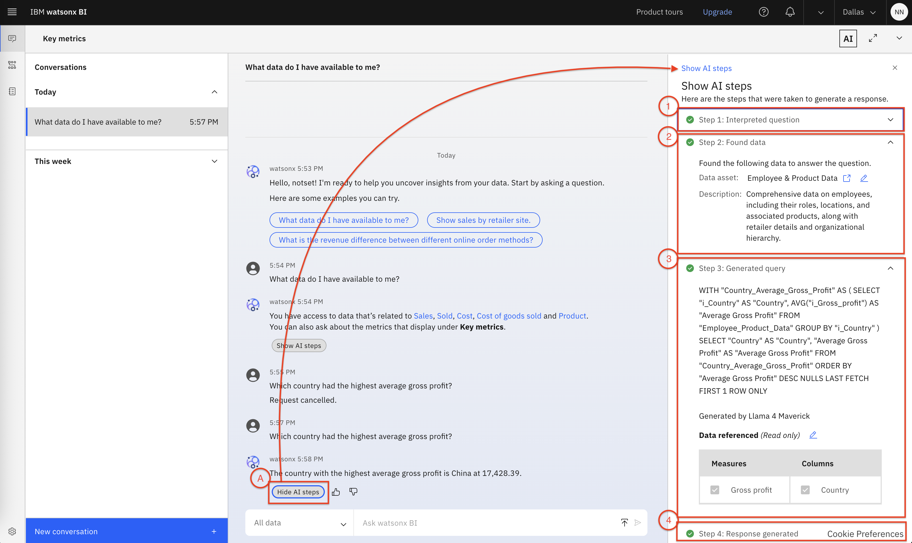

<!-- removing this image 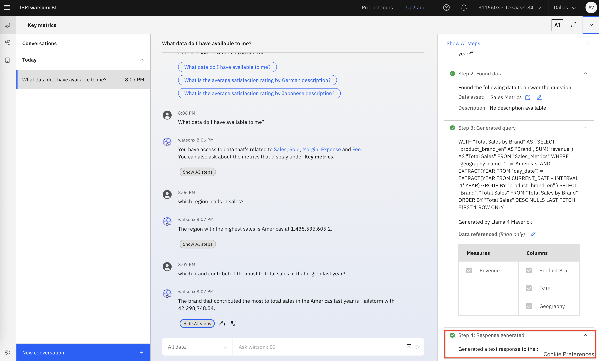 -->

 

### <ins>Let's give it a try:</ins>

**Disclaimer:** *The numerical answers to the same questions may differ from what is shown.*

1. Select the **Go Sales** dataset from the menu
2. Ask the following question followed by the **Enter** key: `which region leads in sales?`
3. Next try this question: `which brand contributed the most to total sales in that region in 2024?`
Please note that in this example the question is rephrased to include the term "America", which was inferred from the previous question to keep the intent in context.

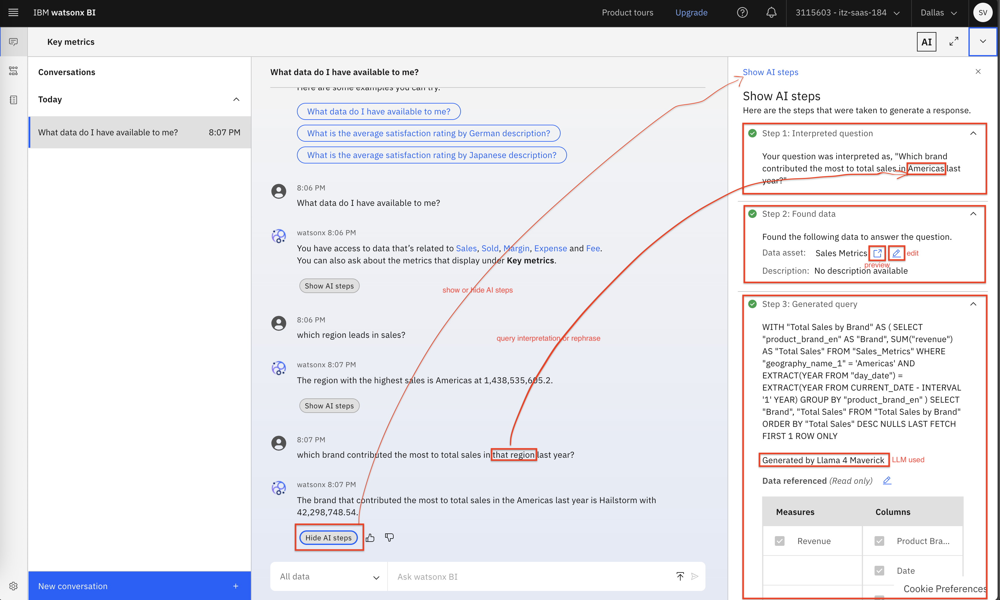

  

Now, let's try a different question: `show me total revenue by year in visualization`

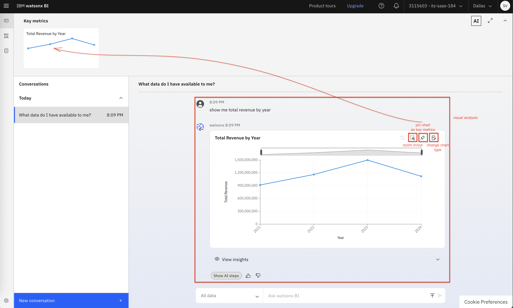

  
Unlike before, it answered with a visualization. That's because watsonx BI can answer with both text and visualizations or a combination of both, depending on what the model thinks is the best representation of your data. In this case, you're asking a question about revenue over time, so the best way to represent that is through a line chart - and that's what you see here along.    

Use the `pin` button to **pin this chart** to your key metrics.  There are also buttons to `zoom in/out` and `change chart type` if you prefer a different type of visualization.

Next, **click** on the **View Insights** button. This displays AI-generated insights about the data in the chart.

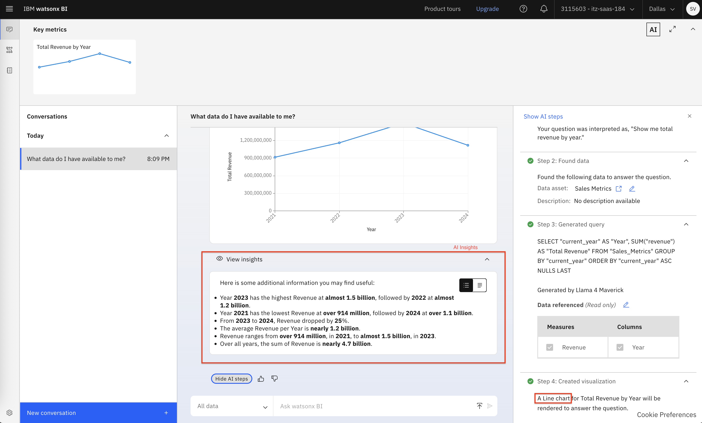

  
We can see that revenue increased in 2023, but then dropped in 2024. 

The next logical question would be _why_. You want to move from _descriptive analytics_ to _diagnostic analytics_.

Ask the following question: `why did revenue drop in 2024?`

A response is generated that explains factors that contributed to revenue dropping in 2024.  Additionally, a new chart is generated.

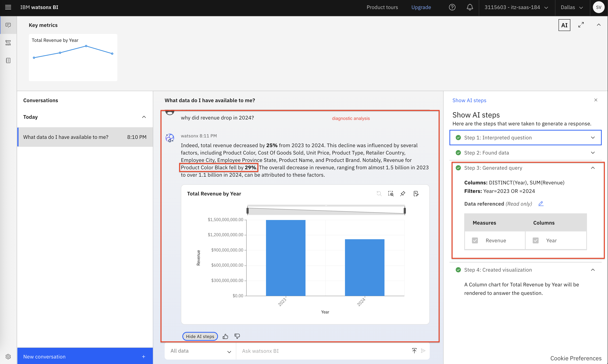

Specifically, it mentions that revenue for goods that were black in color fell by 29%.  We need to better understand it.

You can continue digging to get more insights, based on this new information. 

Ask, `show me Product Color Black's performance by sales channel`

In the resulting answer, you can see the agent interpreted _sales channel_ to be the _order_method_ column in order to retrieve the necessary data.

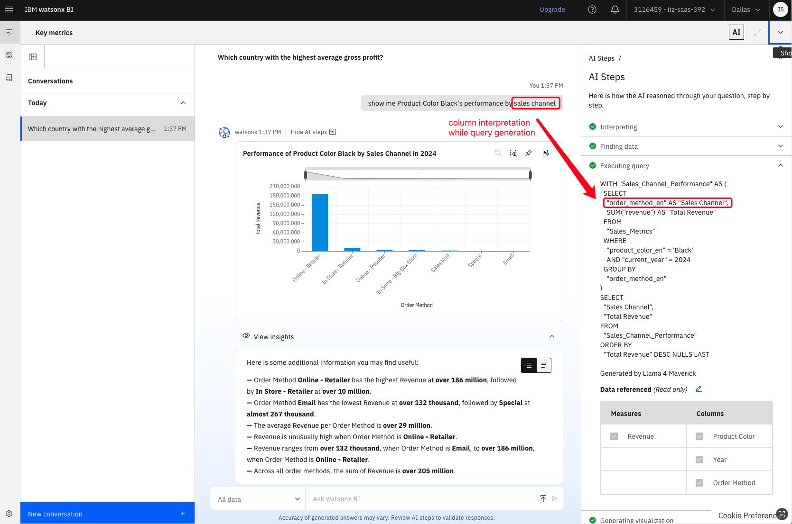

Now, there may be cases where the answer provided does not use the data you were hoping for, such as, in with ambiguous questions.  watsonx BI handles disambiguation by allowing the user to make changes to the AI Steps.

Ask, `What are the top performing products for Product Color Black?`

Once the results are generated, **click** Show AI steps.

**Expand** Step 3. Take note of the tabular representation of the measure and the columns used. It is using Revenue as the measure.

Now, suppose you would rather look at volume rather than revenue.  You can rank by quantity sold, instead of revenue.

Click the **Edit icon** beside Data Referenced. You can see all the other potential matches the agent could have used to answer this question. 

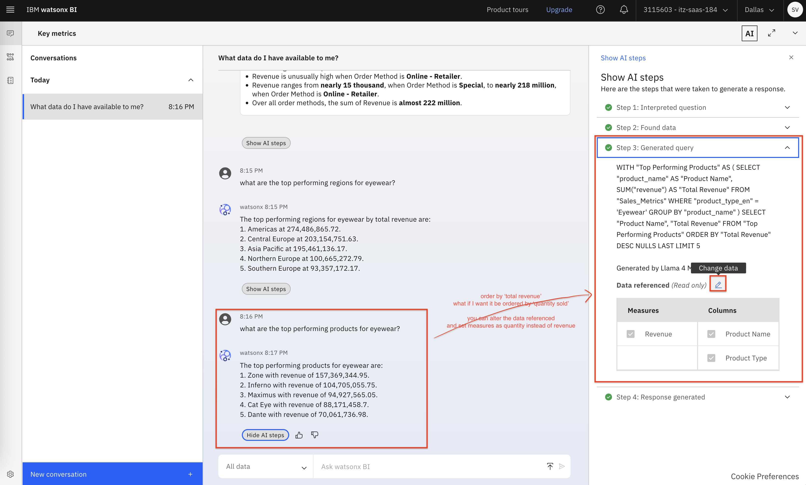

Next, uncheck Revenue and select Quantity.

Select the columns Product Name, and Product Type.  Then, click on **Ask the question again**

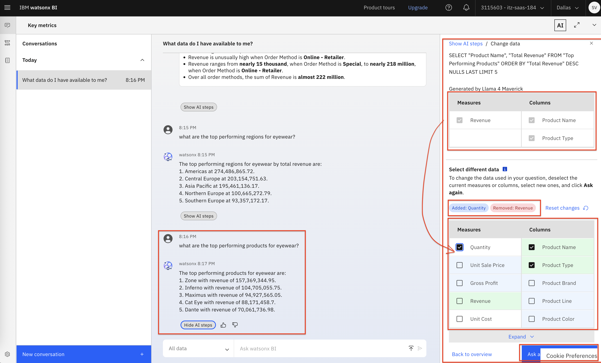

You have now disambiguated on the fly and revised the answer that the agent provided based on the metric that you needed.

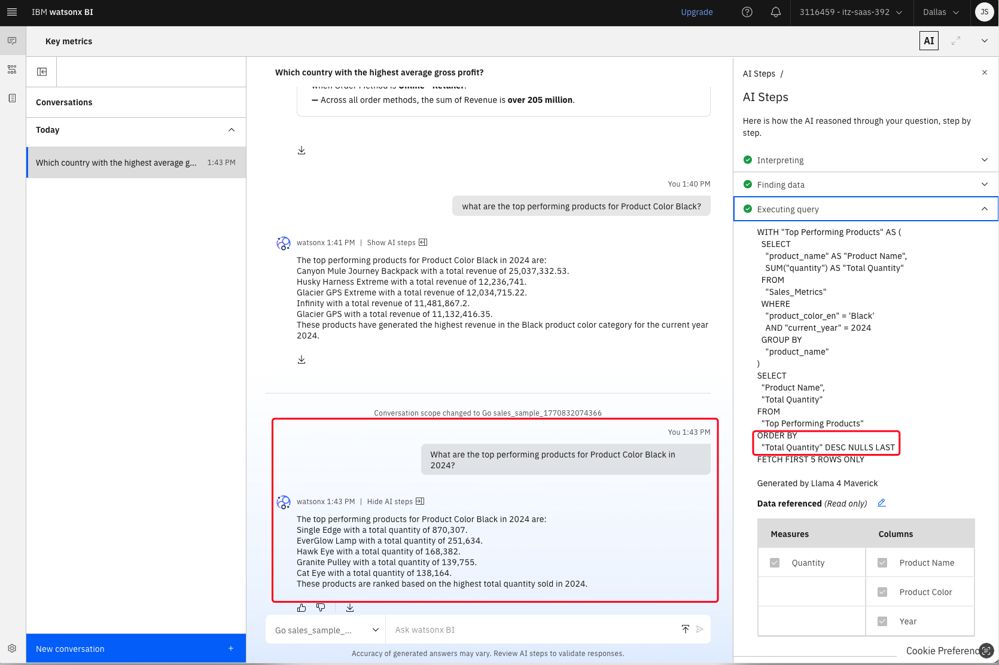

  

Another way to interact with the response is to provide feedback, using the  _thumbs up_ and _thumbs down_ buttons below the response.

Go ahead and **click** the thumbs up button.

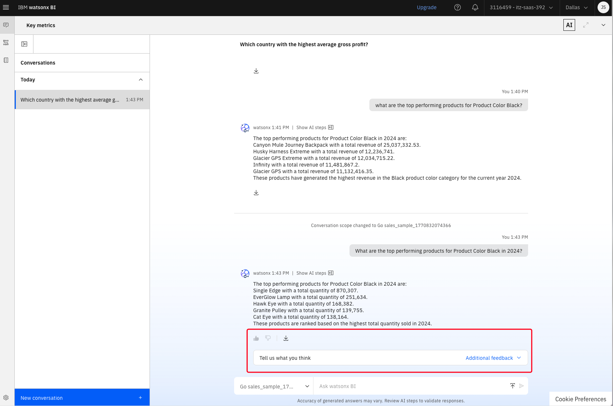

In the resulting box add your comments. Te goal here is to enable the line of business users to quickly provide feedback to the data stewards who are maintaining the semantic layer. However, currently the product teams use this to improve answerability.

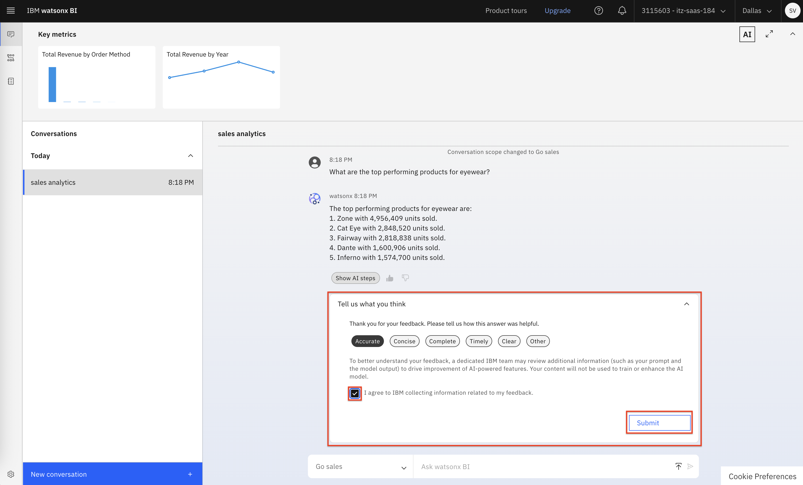

 

At any point, you may rename a conversation with a more relevant headline. You can always go back and revisit an earlier conversation, so this can help find the appropriate one. 

**Right-click** on the conversation, and select **Rename**.

Enter `Sales analytics` in the resulting popup, then click **Save**

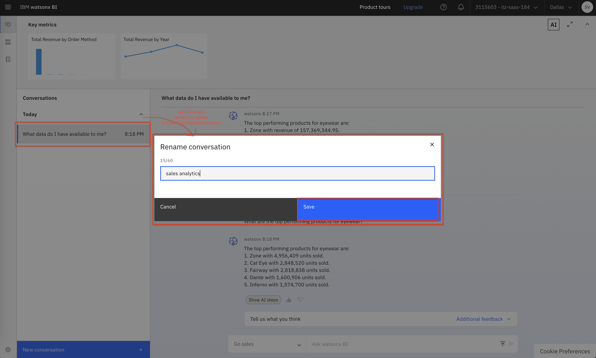

 

Let's shift focus back to the metrics carousal at the top of the screen.

If you hover over a thumbnail for a metric, you can get some information from the pop-up tooltips. You can also click the thumbnail to go into a focus mode.

**Click** the thumbnail.

The following information is displayed:
- AI generated insights, with interesting things that you should know about the data.
- A zoomed in view of the chart. You can interact with the chart here, and, you could even change the chart type.
- Below the chart, you can see dynamically generated suggested questions. The goal here is to guide the user along in their data exploration journey.
- A button to ask a question related to this metric. This is a good option for additional exploration. The metric will take the user into the conversational experience and you could converse with the agent with the data behind the chart held in context.

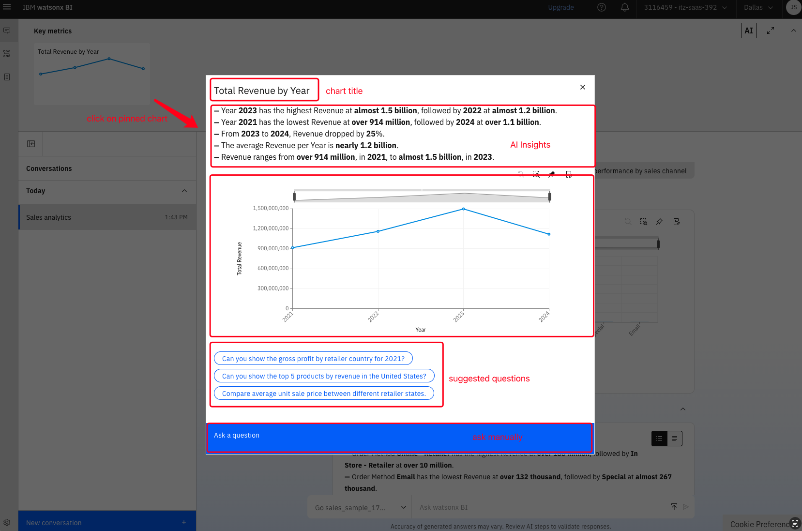

 

This concludes Lab 1.

