# Lab 2 - Data Steward, Analyst, Modeler & Config Experience

This lab dives into the **data configuration workflow**.  

In a typical enterprise the **data steward**, **data modeler**, or **data analyst** will be responsible for setting up and enrich the **semantic layer** which is foundational for a consistent and accurate responses the business questions based on the data in-scope.

---

- [Lab 2 - Data Steward, Analyst, Modeler \& Config Experience](#lab-2---data-steward-analyst-modeler--config-experience)
  - [watsonx BI Workflow](#watsonx-bi-workflow)
  - [Why Semantic Layers Matter?](#why-semantic-layers-matter)
  - [Section 1: Metadata Enrichment](#section-1-metadata-enrichment)
    - [1.1 Create a project](#11-create-a-project)
    - [1.2 Create a semantic model](#12-create-a-semantic-model)
    - [1.3 Create a connection to your data warehouse](#13-create-a-connection-to-your-data-warehouse)
    - [1.4 Perform metadata enrichment](#14-perform-metadata-enrichment)
    - [1.5 Section summary](#15-section-summary)
  - [Section 2: Generating metrics](#section-2-generating-metrics)
    - [2.1 Manually create metrics](#21-manually-create-metrics)
    - [2.2 Metrics definitions](#22-metrics-definitions)
    - [2.3 Visualize metric data](#23-visualize-metric-data)
    - [2.4 Publish metrics to the metrics catalog](#24-publish-metrics-to-the-metrics-catalog)
    - [2.5 Sample Questions to Test](#25-sample-questions-to-test)
    - [2.6 Section summary](#26-section-summary)


---

## watsonx BI Workflow   
Before we get start with the hands-on lab take a moment to review the typical workflow and the key steps involved in building the business metrics that the end users would use.  The diagram below illustrates the major steps and the tasks involved in building the necessary business metrics and publishing to the end users.

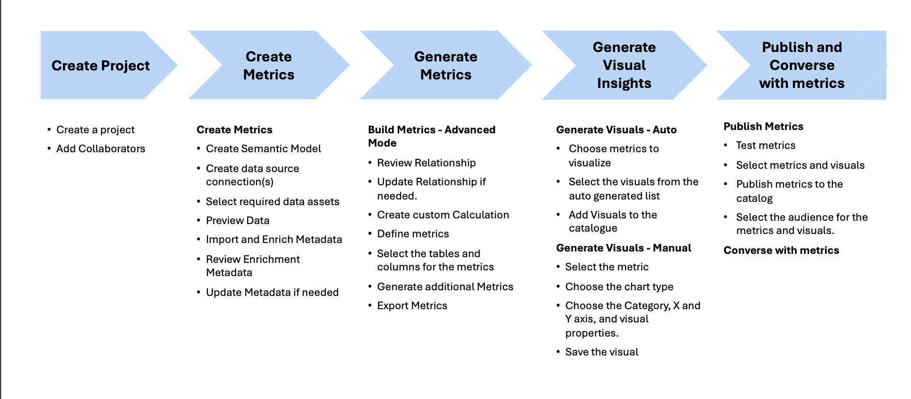 <br><br>

---

## Why Semantic Layers Matter?  
Business users want the answers to be grounded in the business logics related to the business and  relavant data.  The Semantic layer help to ground the responses in the business context by :  
- Providing **a single source of truth** for KPIs and metrics.  
- Ensuring  **consistency and accuracy** in Gen BI (Generative Business Intelligence).  
- Allowing both **automation** and **manual customization** of your business logic.  

This lab will focus on **end-to-end semantic automation** flow, while highlighting where manual adjustments are needed to add value to the accuracy of the responses.

---
**IMPORTANT:** Click on the **IBM watsonx BI** homepage link at the top left to get started with this lab.

---

## Section 1: Metadata Enrichment
This section contains the steps to perform metadata enrichment in IBM watsonx BI, which uses generative AI (with IBM watsonx.data intelligence) to understand data at a deeper level by analyzing the data, while adding a semantic layer of well-defined business context such as business terms, descriptions, and categories to the data. 

Metadata Enrichment adds additional instructions to data, making it more insightful for users. 

Metadata enrichment also generates context-aware descriptions for tables and columns and considering the surrounding columns and the table with respect to the context.

The diagram below shows the key steps and the tasks that you will be working towards in this section of the lab.

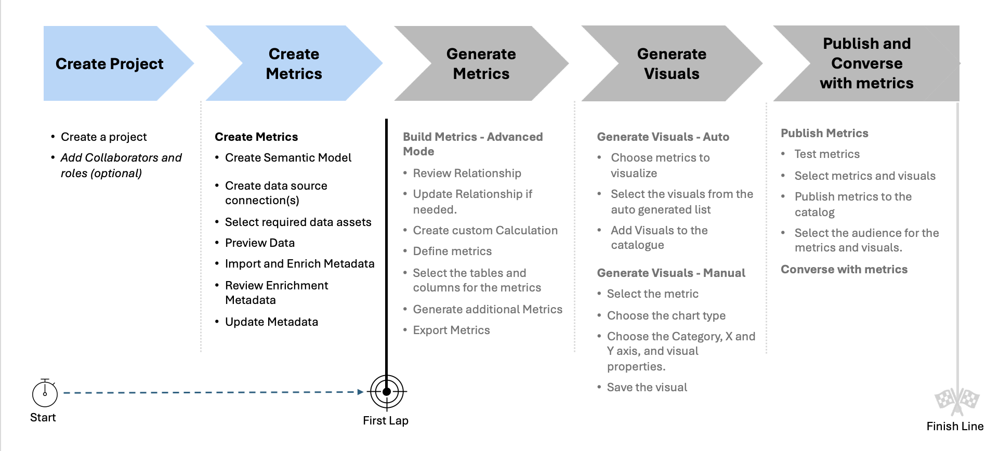 <br><br>


### 1.1 Create a project

A project is a collaborative workspace where users can work with their data and related assets to accomplish a particular goal, such as creating metrics. All of the materials needed to for analyzing the data and generating meaningful business insights are stored within the project.

1. Hover over the left-side of the interface to open watsonx BI’s **side navigation panel**, and then select **Data and Metrics (A)** <br><br>

     <br><br>

2. Create a new project by selecting the **plus sign (+)** in the upper right-side of the interface (A). <br><br>

    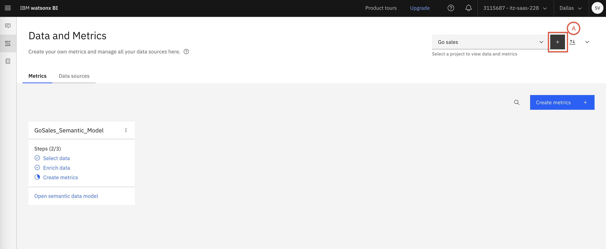 <br><br>

3. Enter the name of the project, **Sales Analysis** for creating new project (A) and select the blue **Submit** button (B).  <br><br>

    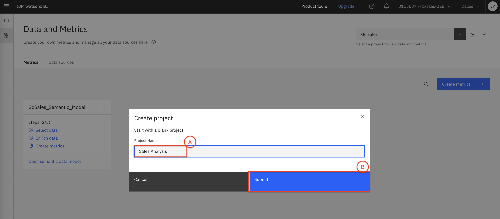


### 1.2 Create a semantic model

IBM watsonx BI uses underlying enriched metadata to create metrics to respond to user questions and provide insights.  Metrics are calculations that are used to measure and monitor key areas of a business. Metrics are a type of asset that are stored in a semantic data model through metric definitions.

1. Click the blue **Create metrics** button (A) to create a metric. <br><br>

     <br><br>

2. Enter the name **Sales Model** (A) to create a semantic model. <br><br>
   
3. Click the blue **Next** button (B). <br><br>

    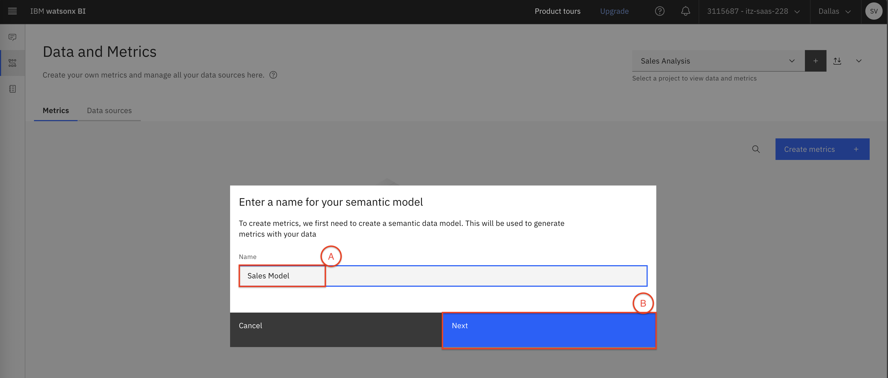

### 1.3 Create a connection to your data warehouse

When creating metrics, data needs to be added to the semantic data model by creating a database connection.  Users can create a new connection or use an existing connection to select data. 

This lab is designed to begin by creating a connection to a data warehouse that holds the sales data, stored in a "IBM Cloud Database for Postgres" database. <br><br>

1. On the **Select data** screen, click the **New Connection** link (A). <br><br>
   
    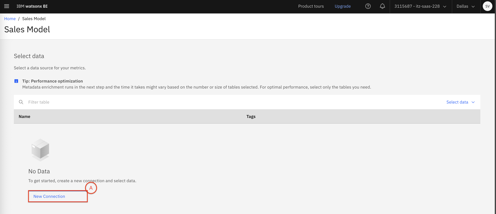 <br><br>

2. The **Add connection** window appears. From the list of available data sources on the left panel, select **PostgreSQL** (A). <br><br>

3. Select the **IBM Cloud Databases for PostgreSQL** connector tile (B) and click the blue **Next** button (C). <br><br>

    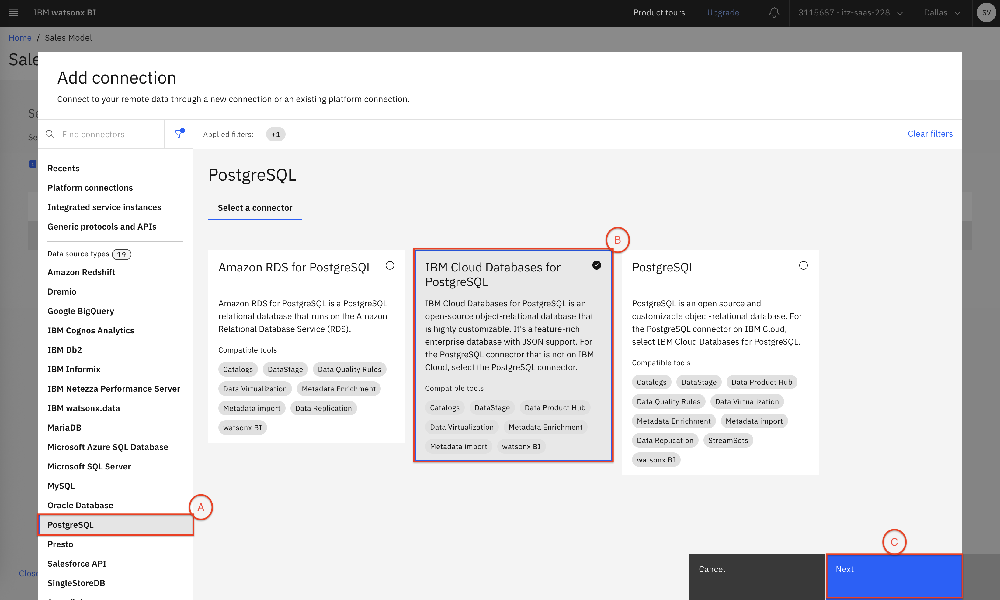 <br><br>

4. The **Create connection: IBM Cloud Databases for PostgreSQL** screen appears. Within the Connection overview subsection, enter **WXBI_SAMPLES** as the **Name** (A) and provide an optional description. <br><br>

    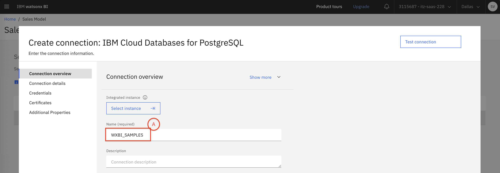 <br><br>

5. Click the **Connection details** tab from the left navigation menu (A) (or scroll down). <br><br>

6. Paste the following details that your instructor shared with you in the appropriate text boxes -
    - **Hostname or IP address** (B)
    - **Port** (C)
    - **database** (D) <br><br>

     <br><br>

7. Click the **Credentials** tab from the left navigation menu (A) (or scroll down). <br><br>
   
8.  Paste the credentials that the instructor provided in appropriate text boxes  -
    - **Username** (B)
    - **Password** (C) <br><br>

9. Click the **Test connection** link in the upper right of the interface (D). You should receive a banner with a green checkmark indicated that **The test was successful** (E). If there are any errors, double-check that you have entered the correct information above. <br><br>
    
10. Click the blue **Create** button (F). <br><br>

    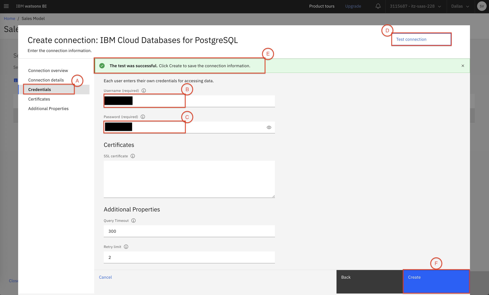 <br><br>

11. The **Add data** window appears. Select: 
    1. **Connections** (A) under  Categories 
    2. **WXBI_SAMPLES** (B) under Connections 
    3. **sample_hr** schema (C) under WXBI_SAMPLES <br><br>

    You might have to waiit for the assets to load. <br><br>

    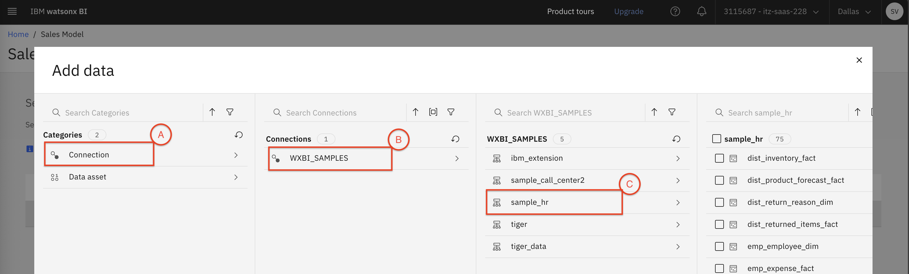 <br><br>

<!-- 12. At the top of the **sample_hr** schema, search for **emp** (A) and select tables:
    - `emp_employee_dim` (B), 
    - `emp_position_dim`, `emp_position_lookup` (C) <br>
    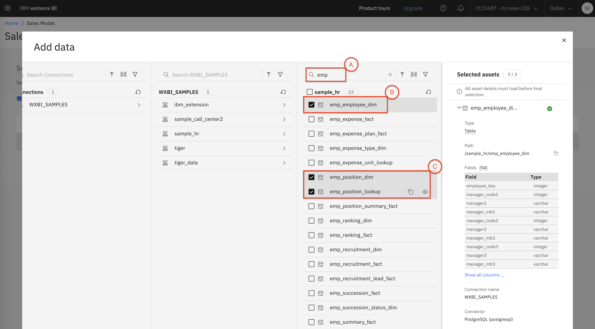 <br><br> -->

<!-- 13. Now, at the top of the **sample_hr** schema, search for **go** (A) and select tables:
    - `go_region_dim` (B), 
    - `go_time_dim` (C) <br>
    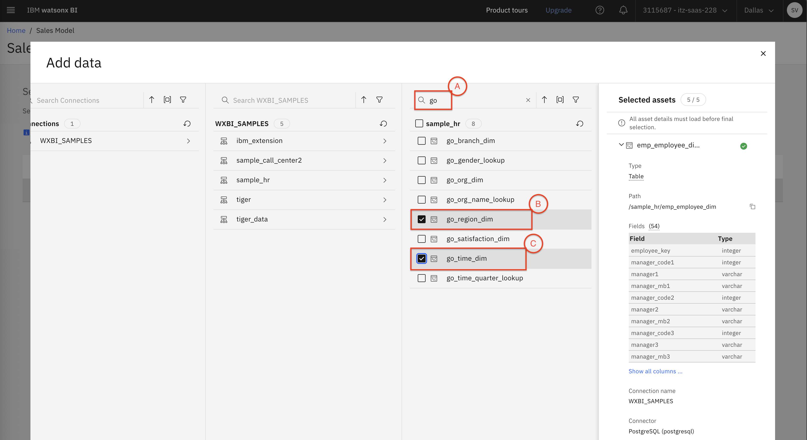 <br><br> -->

1.  At the top of the **sample_hr** schema, search for **sls** (A) and select tables:
    - `sls_order_method_dim` (B), 
    - `sls_sales_fact` (C) <br><br>
  
    Ensure 2 assets are selected by reviewing **selected assets (2/2)** (D) and Click the blue **Add** button (E). 
    - Note: you may need to scroll to the right.  <br><br>
    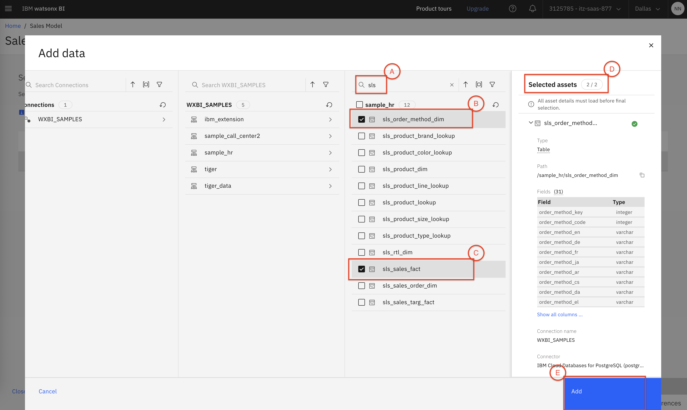 <br><br>

<!-- 15. Finally, at the top of the **sample_hr** schema, search for **view** (A) and select `view_org_dim` (B) <br>
    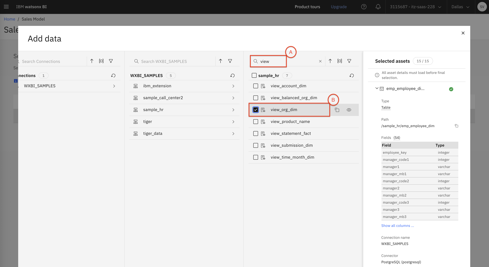 <br><br> -->

<!-- 1.  Ensure 15 assets are selected by reviewing **selected assets (15/15)** (A) and Click the blue **Add** button (B). 
    - Note: you may need to scroll to the right.  <br><br>

    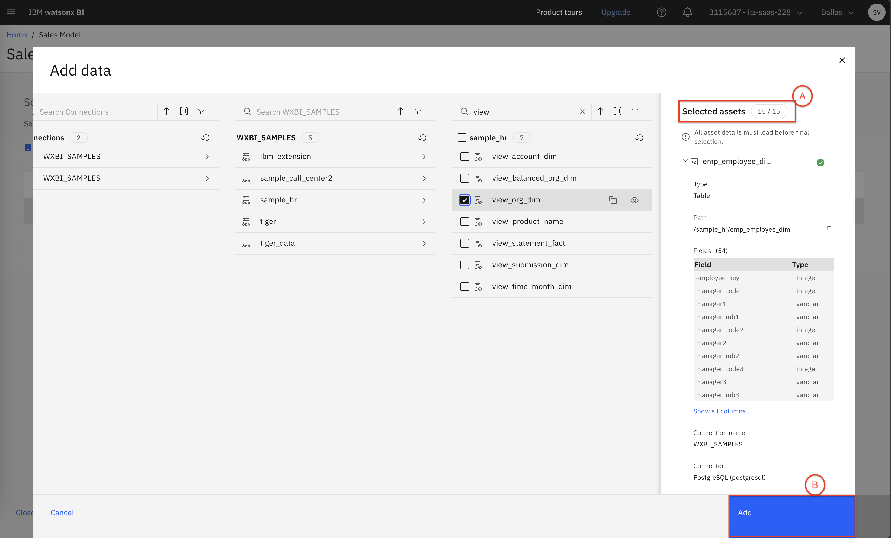 <br><br> -->

2.  The **Select data** window appears. The data stored in the selected tables can be previewed. Click on the 3-dot ellipsis on the right-side of the **sls_sales_fact** table (A) and **Preview** (B) the data. <br><br>

    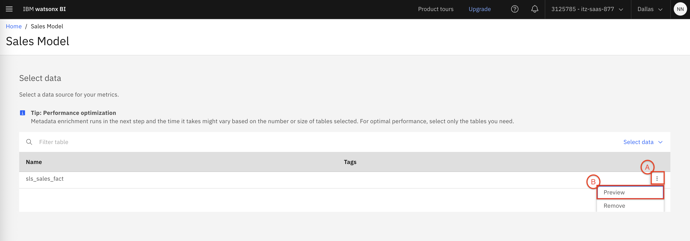 <br><br>

    A sample of the first 100 rows of data stored in the **sls_sales_fact** table is displayed to determine if the correct table is selected to define the metrics. <br><br>

3.  Click the **‘x’** button in the upper-right of the interface to close the preview (A). <br><br>
    
    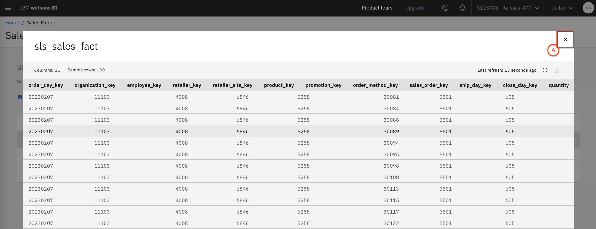 <br><br>

4.  From the **Select data** screen, click the blue **Next** button (A). <br><br>
    
    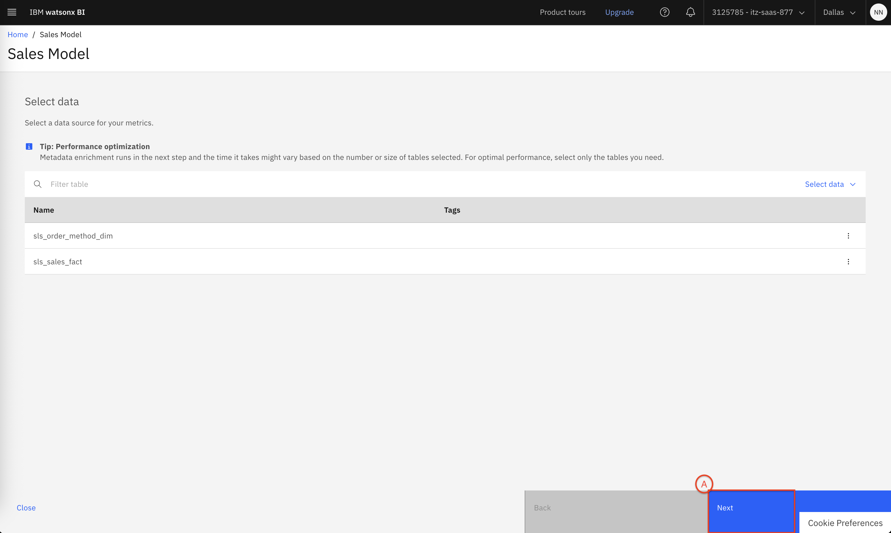 <br><br>

### 1.4 Perform metadata enrichment

The next step in the overall flow is to enrich the Metadata.  Metadata enrichment uses generative AI with watsonx.data intelligence to understand your data at a deeper level, analyzing the data and adding a semantic layer of well-defined business context such as business terms, descriptions, as well as categorizing the data. Enrichment adds additional information to your data, making it more insightful to users and also generating context-aware descriptions for the tables and columns, which considers the surrounding columns and the context of the table. 

1. Click the blue **Run enrichment** button (A). <br><br>
    
    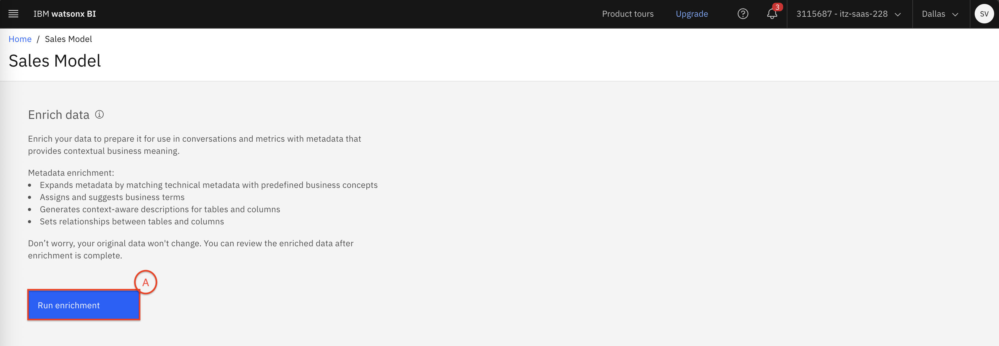 <br><br>

2. Select the **View metadata import and enrichment jobs** link (A) to view the status of the enrichment process. <br><br>
    
     <br><br>

3. All of the jobs (completed and running) in the **Sales Analysis** project appears in a new browser tab. Click on the **Sales Model** metadata enrichment job (A). <br><br>
    
    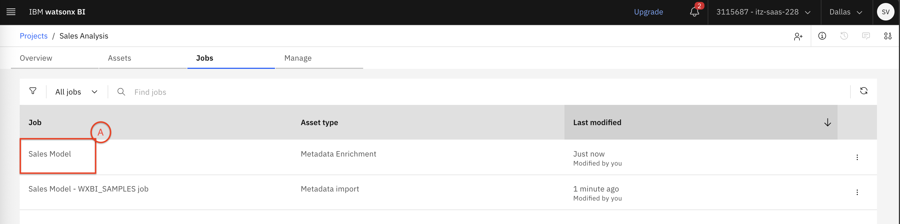 <br><br>

4. The **Job details** page opens. In-case the job to not completed, refresh the status using the refresh button (A). Review the job **Status** change from **Running** to either **completed** or **completed with warnings**.  Click on the latest timestamp of the job run (B) to view the details.<br><br>
   
    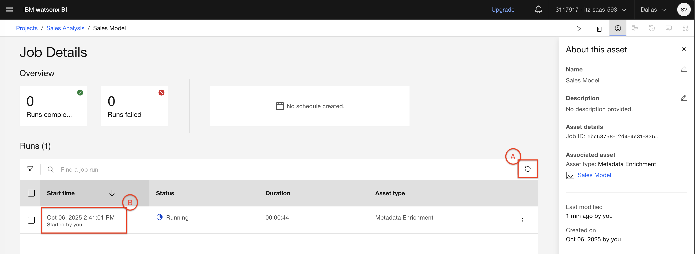 <br>
    
    <!-- 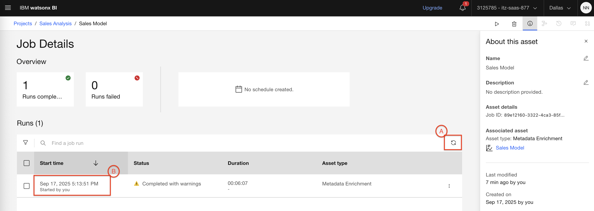 <br> -->

    ⚠️ Note: The metadata enrichment process can occasionally take some time to complete. You can skip this process by importing an already enriched project.<br><br>

5. Navigate to this link: https://github.ibm.com/AmericasTopTeam/wxbi-client-bootcamp/tree/main/Labs/Lab2-data_steward_experience/Sales-Analysis.zip and then click the **Download raw file** icon (A). <br><br>
    
    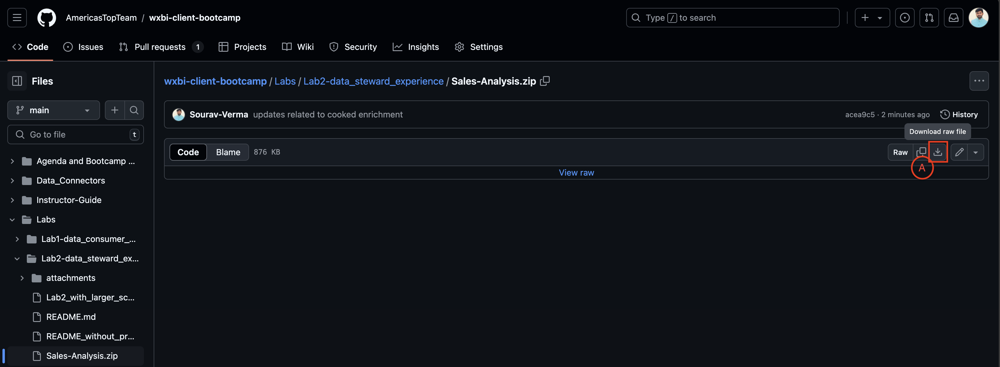 <br><br>

6. Return to your watsonx BI browser session, and from the **Data and Metrics** page, click the **Export or Import Project** icon (A) and click **Import project** (B). <br><br>
    
    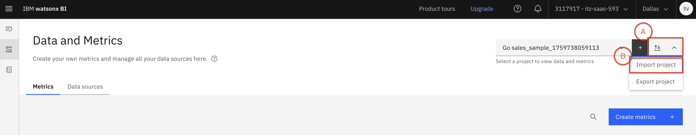 <br><br>
   
7. The **Import project** page opens. In the **New project name** field, enter **Sales Analysis - enriched** (A). Click the **Drag and drop a file here or click to upload** link (B) <br><br>
    
    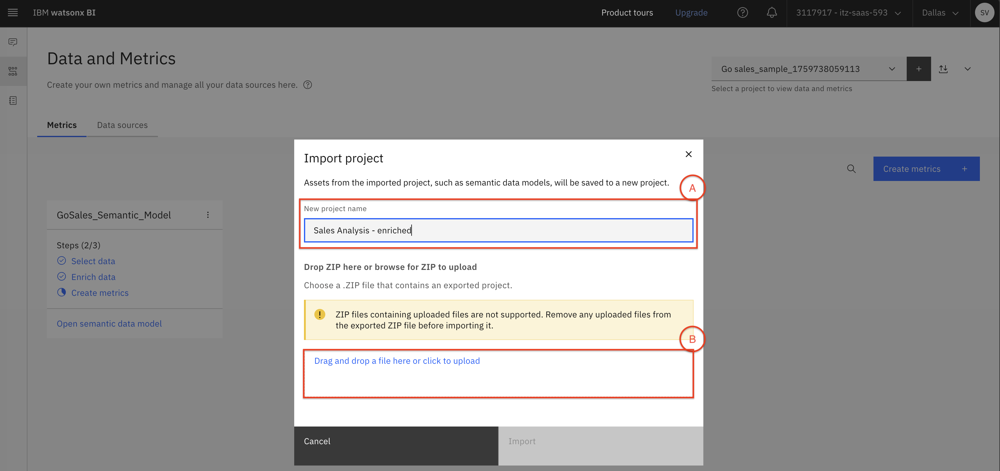 <br><br>

8. Navigate to the location that you downloaded the **Sales-Analysis.zip** file and click **Open**. Click the blue **Import** button (A). <br><br>
    
    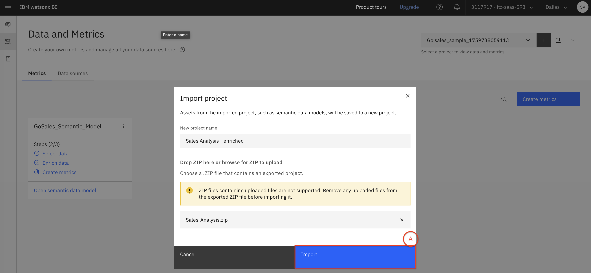 <br><br>

9. The **Import project** page opens. The project imports. When complete, click the blue **Go to Data and metrics** button (A). <br><br>
    
    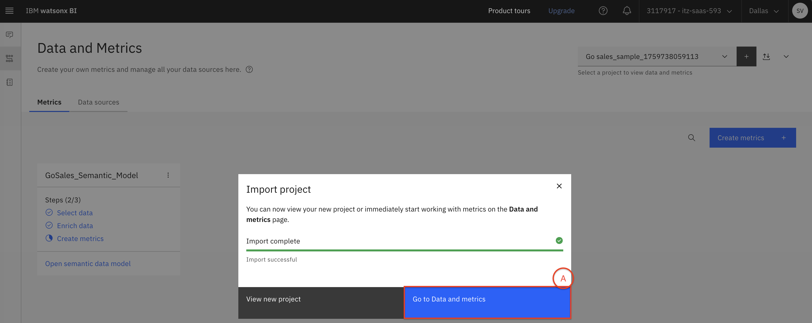 <br><br>

10. Click the **navigation icon** (A) and then expand **Projects** (if necessary) and click **View all projects** (B). <br><br>
    
    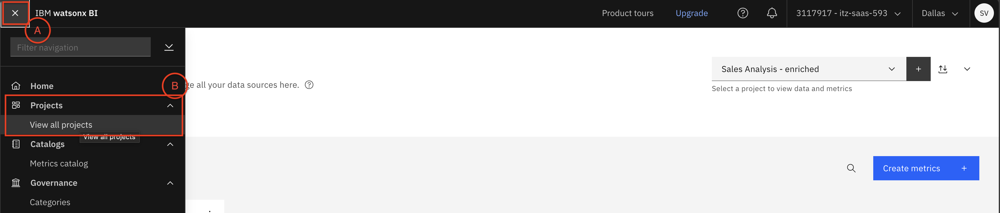 <br><br>

11. The Projects page opens. Click on the **Sales Analysis – enriched** project (A) that you previously imported. <br><br>
    
    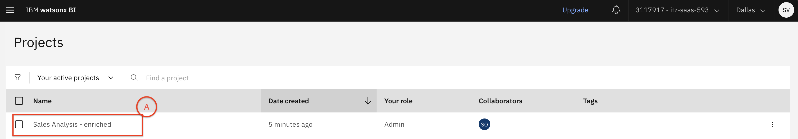 <br><br>

12. Click the **Assets** tab (A) and then click the **Sales Model** metadata enrichment asset (B). <br><br>
    
    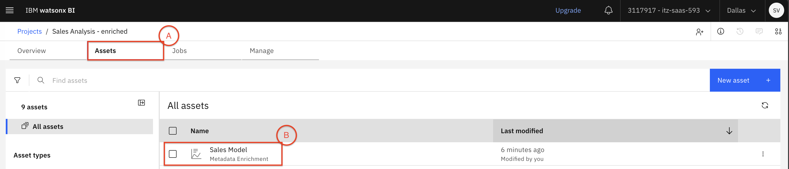 <br><br>

13. You can view the enriched data at both the assets level and the column level. Landing on the **Assets** tab, you can see the 2 tables that you included from your data source, each as an individual row. Scrolling to the right, you can see **display names** that were generated by the LLM for each table (A), as well as **suggested table descriptions** (B) and **business terms** (C). <br><br>

    By default, the following information is provided for each data asset in the scope of the metadata enrichment on the **Assets** tab: <br><br>

    Asset name (for relational data, also the table type is shown)
    - Source information
    - Display name - You can edit the names and accept suggested names.
    - Description - You can edit the descriptions and accept AI-suggested descriptions.
    - Assigned business terms and the number of suggested terms
    - Assigned classifications
    - Assigned primary keys and the number of suggested ones
    - Overall data quality score that was achieved in the enrichment
    - Review status
    - The status and the date and time of the last enrichment <br><br>
  
    The best practice would be to go through every row in this table and make sure the AI-generated  display names, descriptions, and business terms are accurate and consistent with your enterprise. <br><br>

<!-- 14. The "About this run" screen provides information about the enrichment job, including details about the **Objectives** (A) of the run and asset failures along with other details. Click the **Log** tab (B) to view the detailed job log.<br><br>
    
    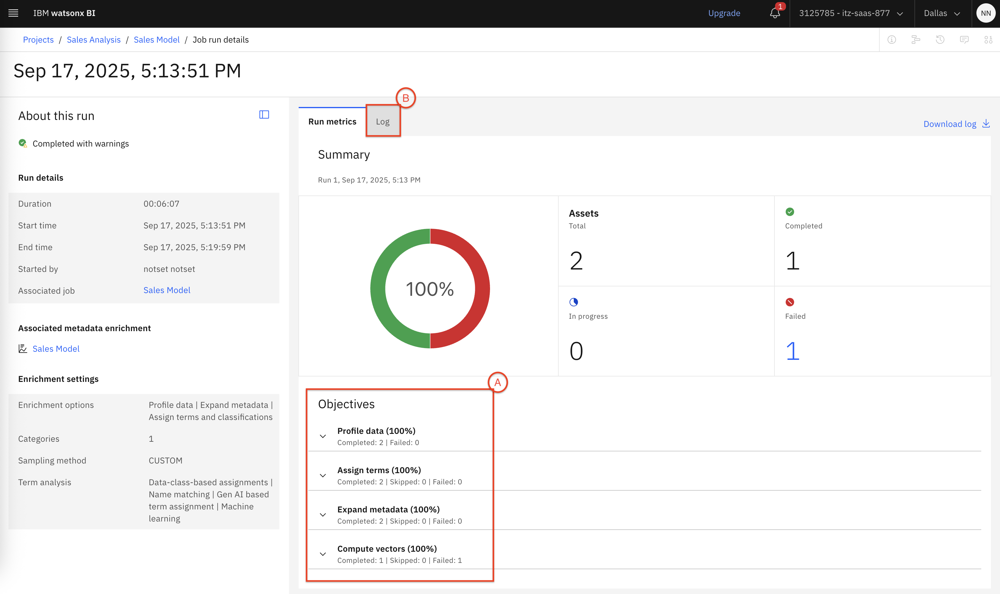 <br><br>

15. In this example, scrolling down the log shows a non-fatal asset issues (A). These is relate to tables which does not have string columns, so they can be ignored. <br><br>
    
    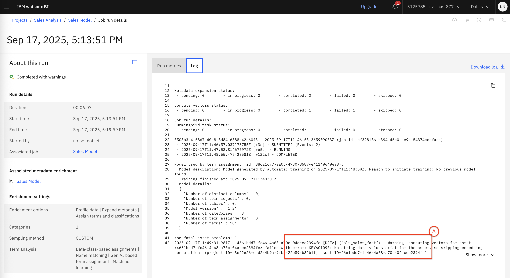 <br><br>

16. Close the **Job run details** browser tab to return to the **Enrich data** browser tab. Click the **Review enriched data** link (A). <br><br>
    
    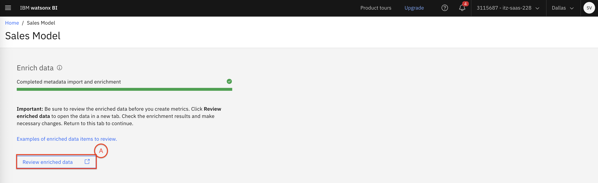 <br><br>

17. The enriched metadata opens in a new browser tab. Scroll to the right to view the **display names** that were generated for each table (A), as well as **suggested table descriptions** (B) and **business terms** (C).   The best practice is to go through every row in this table and make sure the AI-generated display names, descriptions, and business terms are accurate and consistent with the way the enterprise defines or describes. <br><br> -->
    
    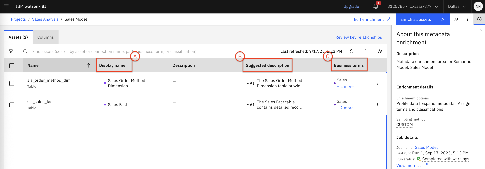 <br><br>

18. Click on the: 
    - **sls_sales_fact** row (A) to evaluate the AI-generated table description.
    - **Show more** (B) link to view the full description, if needed.
    - Checkbox (C) to accept the AI-generated description. 
    - Alternatively, Click on the pencil icon next to the description to update the descriptions manually <br><br>
    
    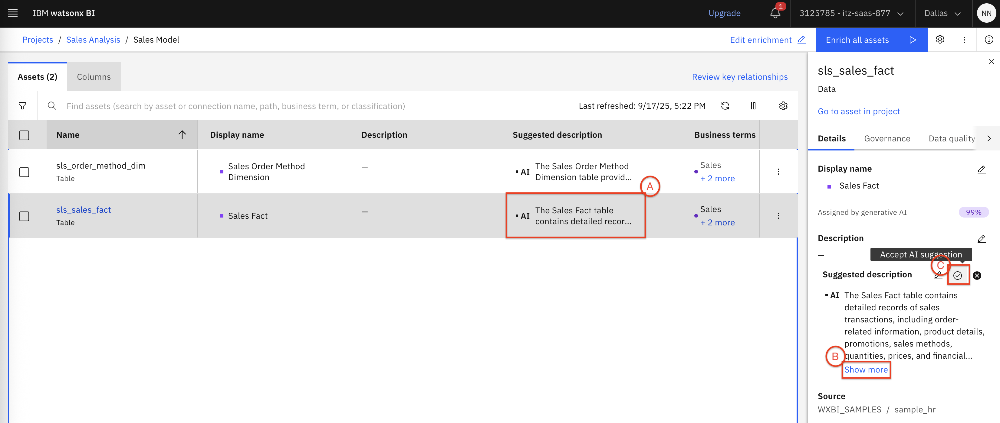 <br><br>

19. Once the AI suggested descrptions are accepted, that become the actual description (A) for that row. <br><br>
    
20. To apply any updates to the metadata, the enrichment job must be run by clicking the blue Enrich all assets button (B) - **not required for the lab.** <br><br>
    
    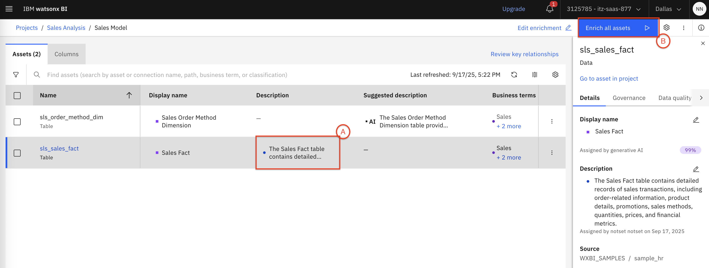 <br><br>

<!-- 21. Close the **Sales Model** browser tab to return to the Enrich data browser tab, and then click the blue **Next** button (A). <br><br>
    
    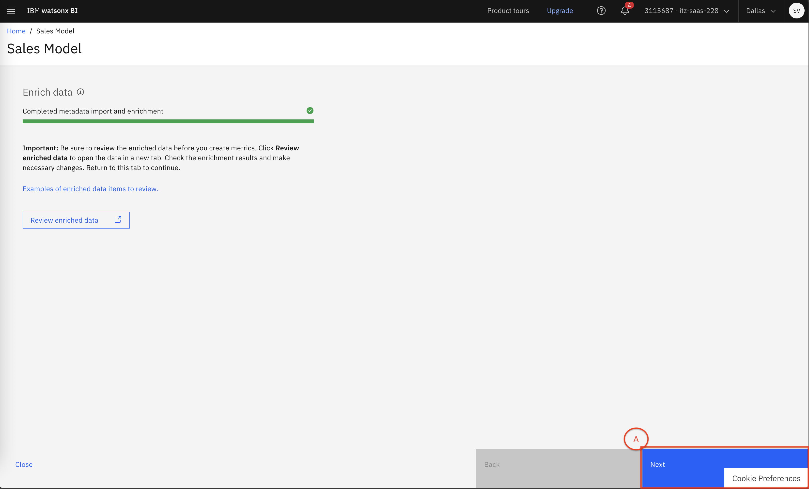 <br><br> -->

    Constructing and publishing the metrics for end users will be covered in the next section of this lab.

### 1.5 Section summary

In this section : 
- You have learned to create a project to contain all of the assets that will be associated with analyses and metrics in watsonx BI.
- You have created a semantic model by connecting to a database which stores sales transactions and choosing the data that you wanted to include.
- Enriched the metadata associated with your table in order to augment understanding with business terms, AI-generated table and column descriptions.

## Section 2: Generating metrics

The diagram below shows the key steps and tasks you will be working towards to publish the business metrics that the end users will use in order to gain business insights from the data assets.

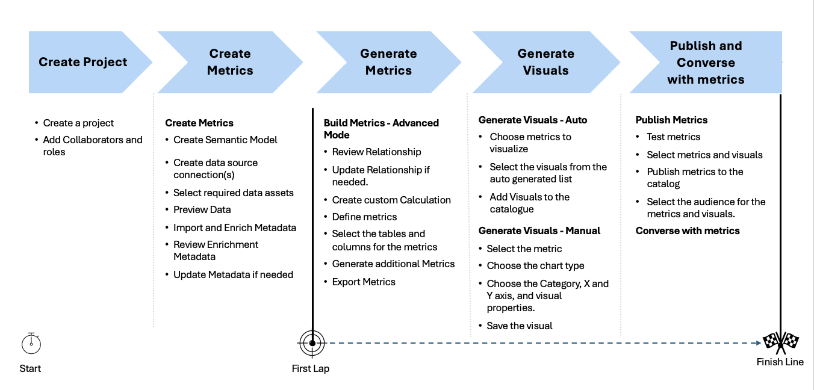

**Note** - It is okay in-case the semantic model representation and the generated metrics definition names differs from the screenshots below.

### 2.1 Manually create metrics

1. Return to the **Data and Metrics** page and open your semantic model. watsonx BI provides flexibility to either generate the metrics automatically or build the metrics manually. Click the **Build metrics in advanced mode** tile (A) to start building metrics manually. <br><br>
    
     <br><br>

    If prompted for Advanced mode, click `x` to exit.<br><br>

    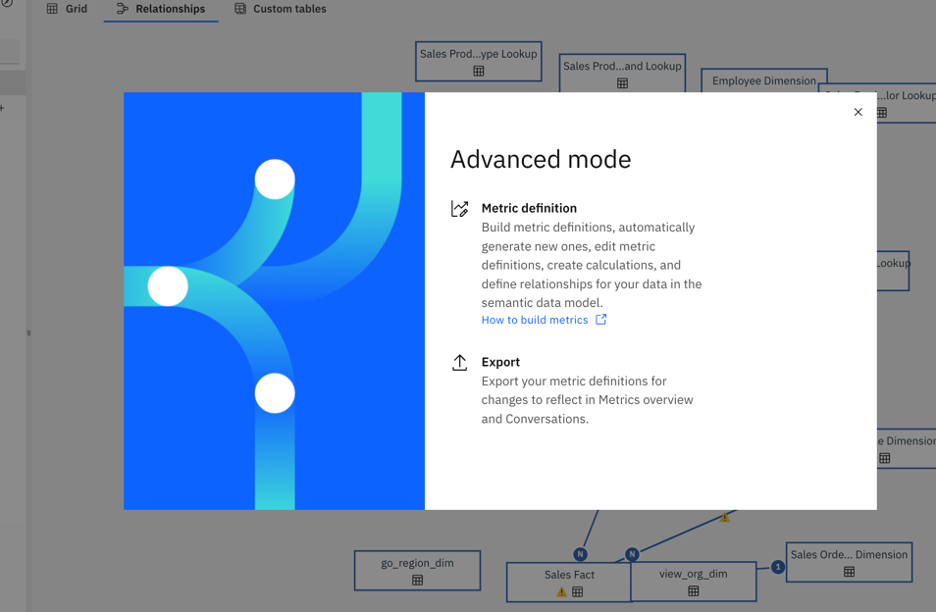<br><br>

    IBM watsonx BI leverages defined relationships within the data source and the builds a semantic model with enterprise-grade modeling capabilities, including the ability to create calculations, modify relationships, define filters, etc. 
    
    Your initial view presents all relationships in the database. Notice how the tables reflect the generated display names. <br><br>
    
    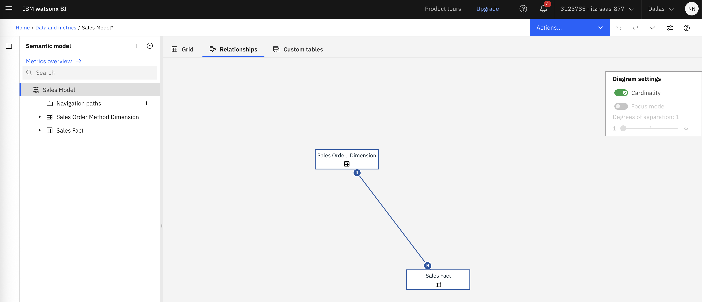 <br><br>

2. Click on the **Sales Fact** table (A).  <br><br>
   
3. Toggle **Focus mode** (B) to disable focus mode at any time to show all relationships. <br><br>
    
    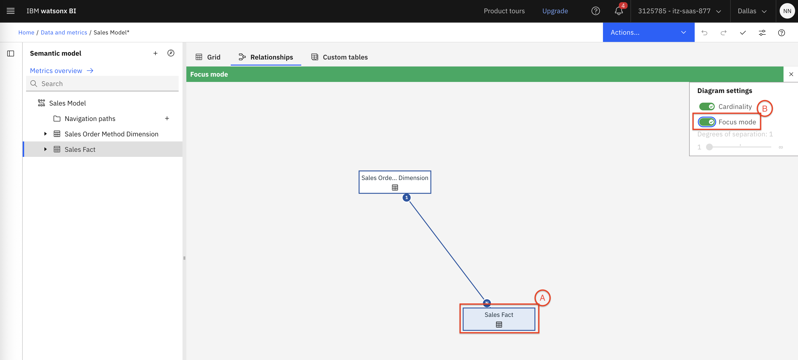 <br><br>

4. From the **Semantic model** panel on the left-side of the interface, hover over the **Sales Fact** table and click on the 3-dot ellipsis that appears (A). <br><br>
   
5. Review the modeling options available, and then select Calculation (B). <br><br>
    
    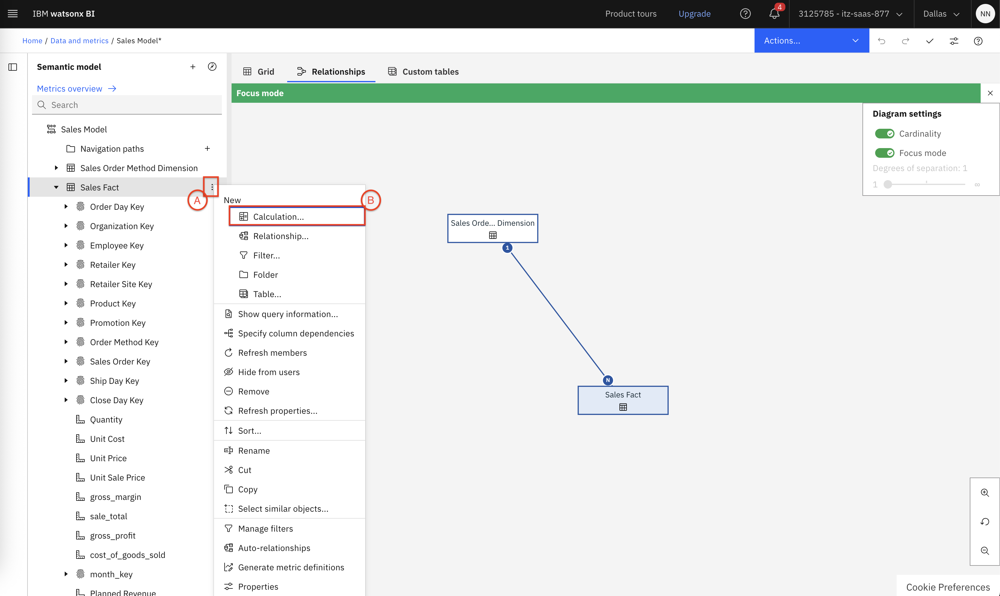 <br><br>

6. The **Create calculation** screen appears. Under **Name** enter **Revenue** (A). <br><br>
   
7. Enter the following expression, either by cutting and pasting from this lab guide, or dragging and dropping the columns into the expression editor (B): <br><br>
    
   ```sh
    quantity * unit_sale_price
   ```

8. From the toolbar, click the **Validate** button (C). <br><br>

    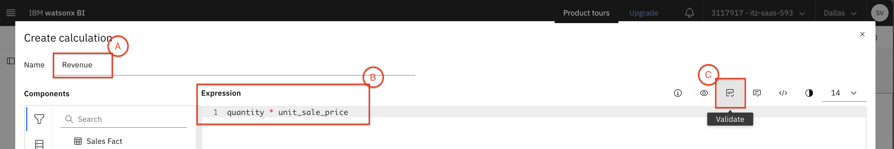 <br><br>

9. The **Log in to connection** window opens. Enter credentials:
    - **wxbidemo** in the **Username** field (A) and 
    - **Bootc@mp2025** in the **Password** field (B)<br><br>
  
    Click the blue Login button (C). <br><br>

     <br><br>
   
1.  When you see the validation results as *The expression is valid* (A), click the blue **Ok** button (B). <br><br>
    
    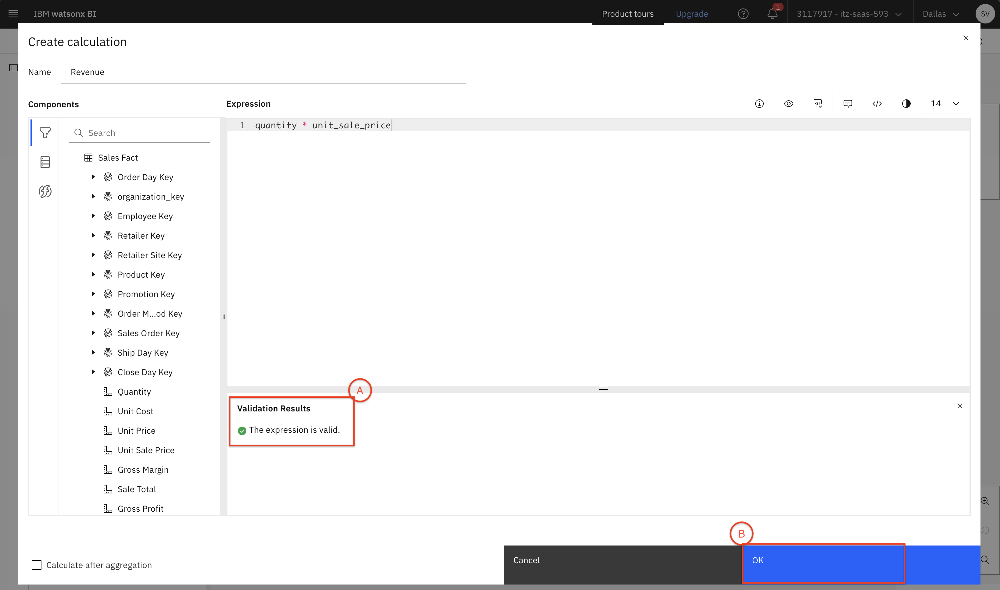 <br><br>

    The next step is to build metrics definitions.

### 2.2 Metrics definitions

A metrics definition is a clear description of a measure (or key performance indicator) which is unique to the business and has a clearly defined data scope.

1. Expand the **Sales Fact** table from the Semantic model panel (A). <br><br>
   
2. You should see the calculation you built in the previous section. Hover over the **Revenue** calculation and click on the 3-dot ellipsis that appears (B). <br><br>
   
3. Click **Metric definition** from the context menu (C). <br><br>
    
    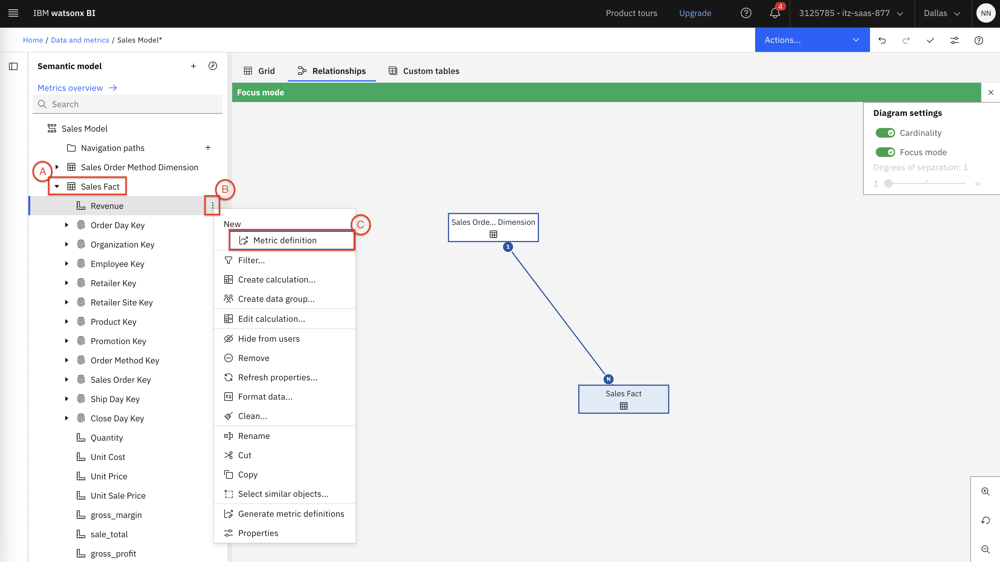 <br><br>

4. The **Metric definition** window appears. Enter **Revenue** in the Label text box (A) and add a Description (B). <br><br>
    
    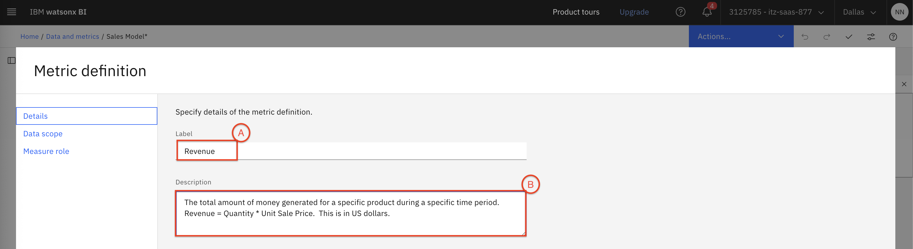 <br><br>

5. Click the **Data scope** tab from the left navigation menu (A). <br><br>
   
6. Expand the tables to see all columns that have been automatically added to the data scope for **Revenue** metric (B). <br><br>

7. Click the blue **Done** button (C). <br><br>
    
    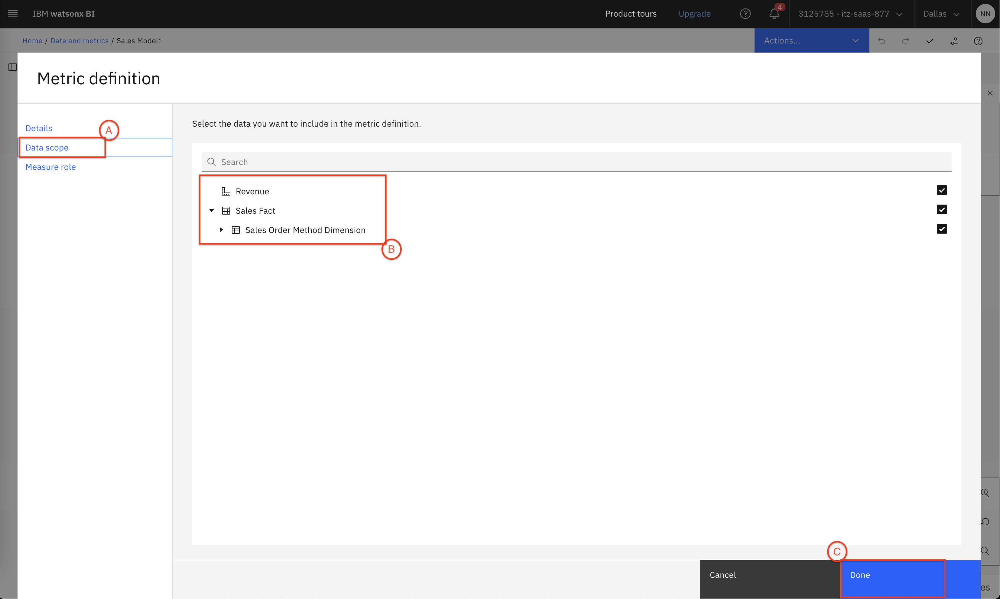 <br><br>

8. Hover over the root **Sales Model** object in the Semantic model panel and click on the 3-dot ellipsis (A). <br><br>
   
9. Select **Generate metric definitions** from the context menu (B). <br><br>
    
    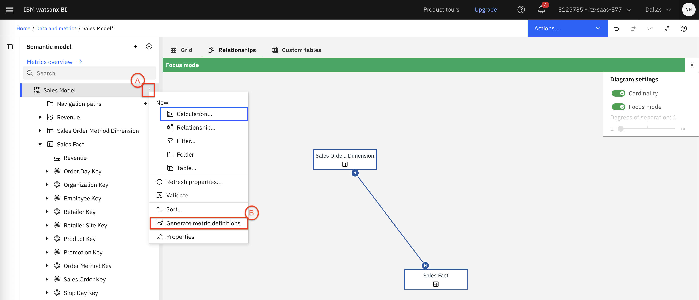 <br><br>

10. IBM watsonx BI evaluates the metadata in the model and automatically generates additional metrics definitions that it believes will be useful for your business (B). <br><br>
    
11. Once complete, it will store those definitions at the top of the semantic model panel (A). <br><br>
    
    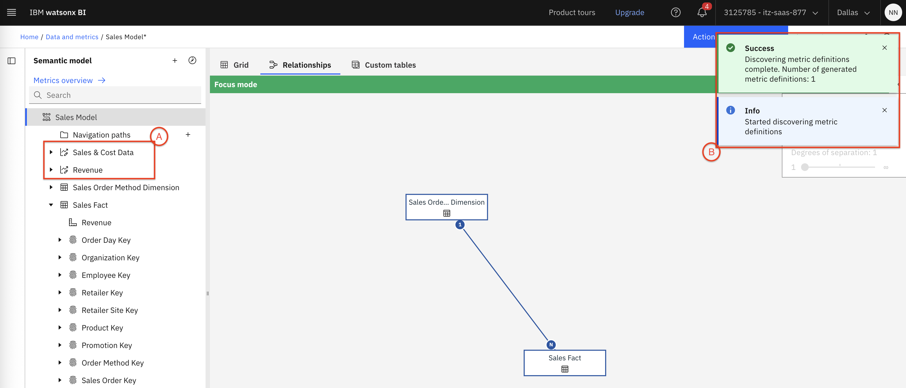 <br><br>

12. Expand the blue **Actions** menu (A). <br><br>
    
13. Select **Save** from the drop-down menu (B). <br><br>
    
    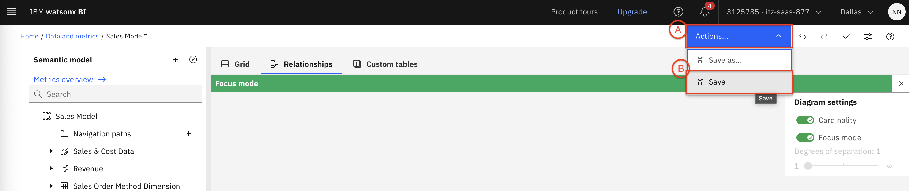 <br><br>

14. When the model has completed saving, you should see a green message indicating that it has saved successfully (A). <br><br>
    
    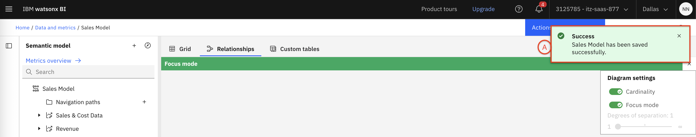 <br><br>

15. Hover over the **Revenue** metric that you created and click on the 3-dot ellipsis that appears (A). <br><br>

16. Select **Export metric definition** from the context menu (B). <br><br>
    
17. You will receive a message in green that the metric exported successfully (C). <br><br>
    
18. Repeat steps 15 and 16 to export the metrics definitions for the remaining metrics (D) in your semantic model - the metrics names might not look the same as shown and that's okay.  <br><br>
    
    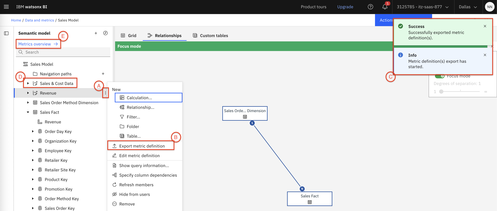 <br><br>

    You will now create visualizations associated with your metrics.

### 2.3 Visualize metric data
You can visualize your metrics by adding visualizations to them. Visualizations can help to quickly see how your data is trending, compare data points, determine relationships between data, and more.

1. Click on the **Metrics overview** link (A). <br><br>
    
    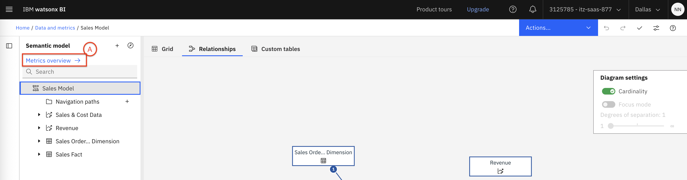 <br><br>

2. You are provided with an overview of the generated metrics, the ability to generate visualizations (or build them manually), and a method for publishing the metrics to your users. <br><br>
    
    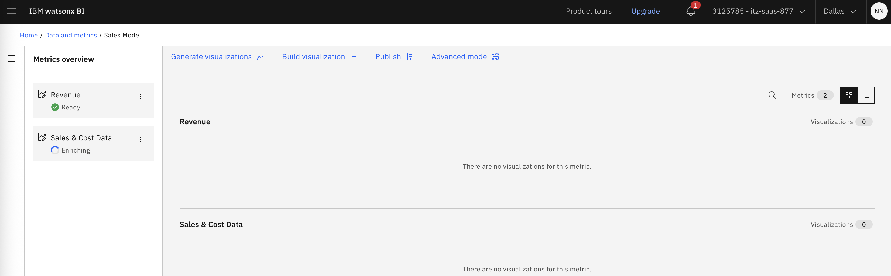 <br><br>
   
3. When all of the metrics have completed their enrichment process and have a status of **Ready** (A) click on the **Generate visualizations** link from the toolbar (B). <br><br>
    
    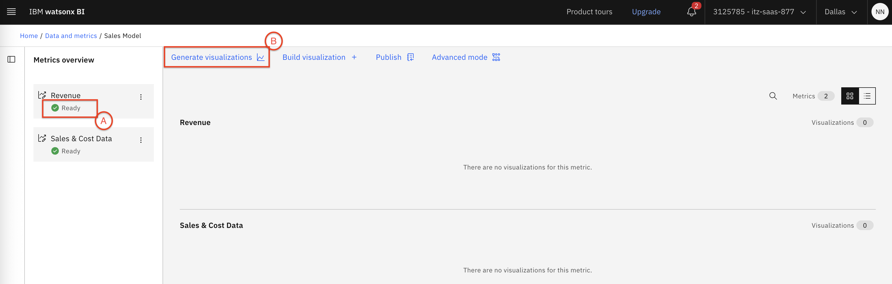 <br><br>

4. The **Generate visualizations** window appears. Multi-select all the metrics by checking their associated checkboxes (A). <br><br>
   
5. Click the blue **Next** button (B). <br><br>
    
    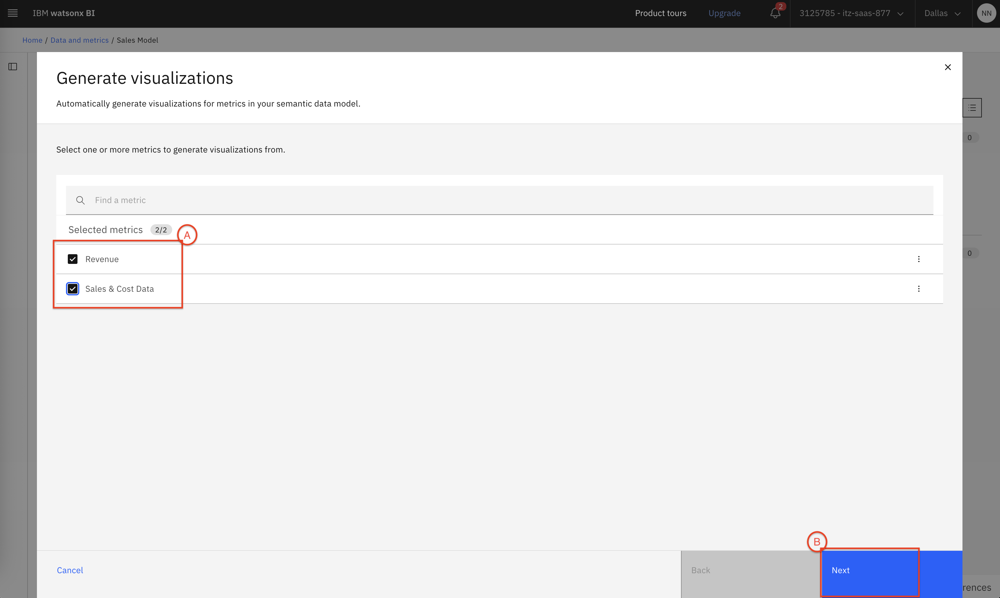 <br><br>

6. IBM watsonx BI has created 5 different visualizations from the data in the scope of each metric definition (A). <br><br>

7. Check one of the visuals from **Revenue** metric definition visualization (B). <br><br>
   
8. Click the blue **Add** button (C). <br><br>
    
    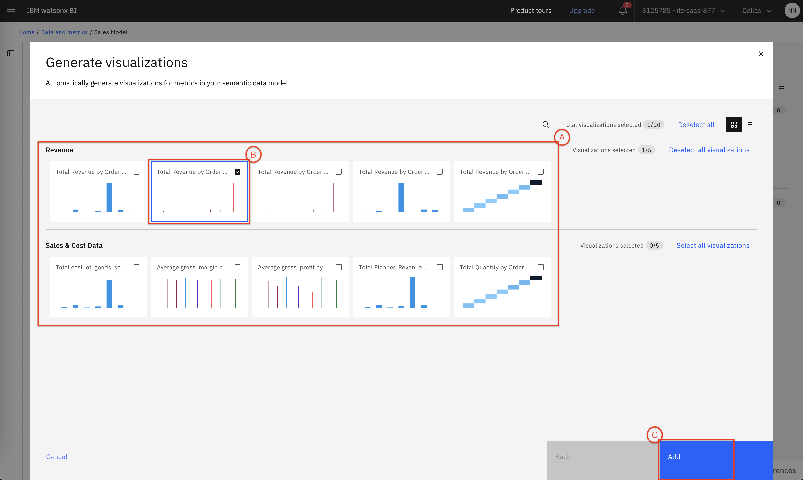 <br><br>

9.  The visualization is added to the Metric overview. Click on the 3-dot ellipsis beside the metric that was created previously. (A) <br><br>
   
10. Select **Build visualizations** from the context menu (B). <br><br>
    
     <br><br>

11. The **Build visualization** window appears. From the gallery of available visualizations, scroll down and click the **Stacked column** chart type (A). <br><br>
    
12. Click the **Chart** fields tab (B). <br><br>
    
    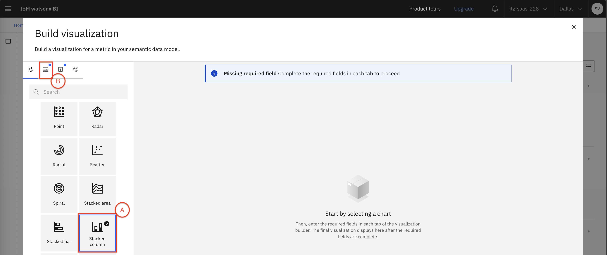 <br><br>

13. Click the **Add field** button below **Categories** and select **Order Method - English** (A) or similar field. <br><br>
    
14. Click the **Add field** button below **Values** and select **Revenue** (B). <br><br>
    
15. Click the **Add field** button below **Color** and select **Quantity** (C). <br><br>
    
16. Click the **Visualization details** tab (D). <br><br>
    
    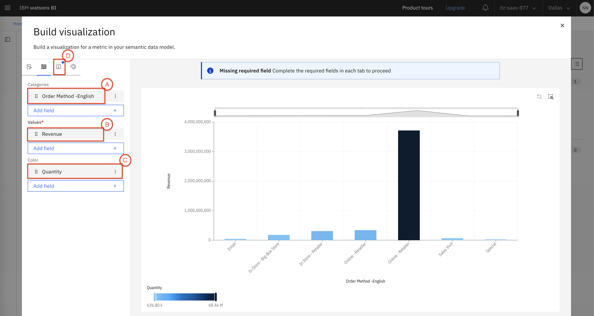 <br><br>

17. Under **Visualization name** enter **Revenue by Order Method** (A). <br><br>
    
18. Under **Chart title** enter **Revenue by Order Method** (B). <br><br>
    
19. Select the **Chart properties** tab (C). <br><br>
    
    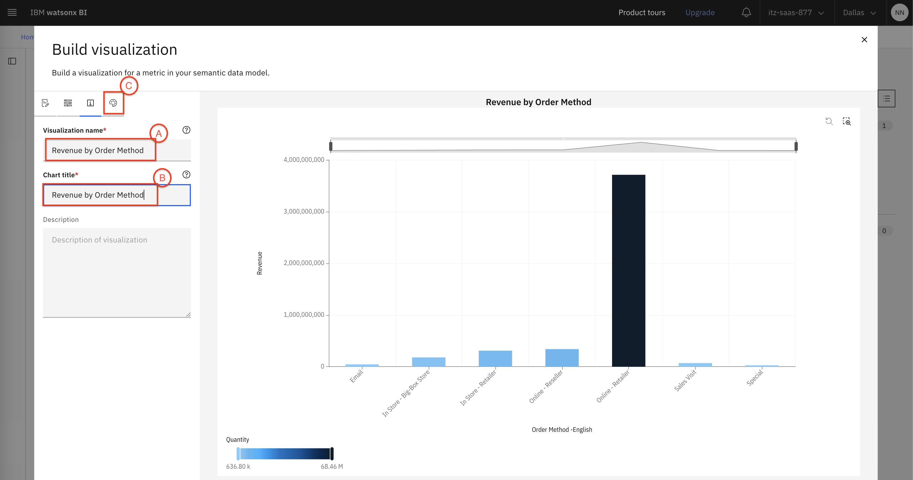 <br><br>

20. Here you can control and modify the chart properties to align with the needs of your business, including color palettes, axis labels and colors, or fill colors. Expand the Chart drop-down (A) and click the **Show legend** toggle to enable/disable the legend (B). <br><br>
    
21. The chart is interactive, so if you hover over a value you can see the related details, making the legend less useful (C). <br><br>

22.  Click the blue **Save** button (D). <br><br>
    
        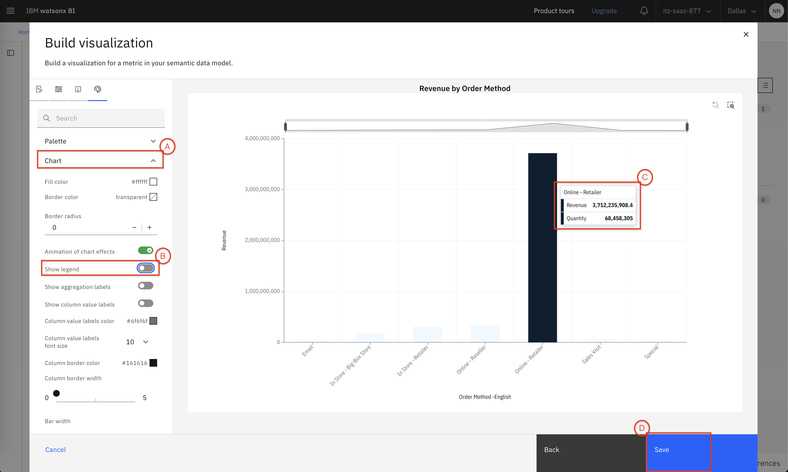 <br><br>

### 2.4 Publish metrics to the metrics catalog

The metrics catalog is a centralized repository of published metrics, their metrics definition details, and related visualizations. It provides a single source of truth for published metrics that are used across the organization. 

By publishing metrics to the catalog, analytics consumers can quickly see the metrics and visualizations that they have access to, and browse for metrics that interesting them, then pin them to their key metrics or ask questions for a specific metric directly from the catalog.

1. Click the **Publish** link (A). <br><br>
    
    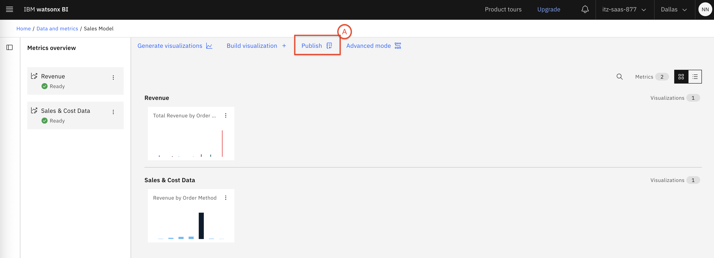 <br><br>

2. The **Publish** window appears in the **Select metrics** section. From the **Select the metrics and visualizations that you want to publish** area, check the metrics with visualizations that you’ve created by checking the checkbox within the visualization (A). <br><br>
   
3. Click the blue **Next** button (B). <br><br>
    
    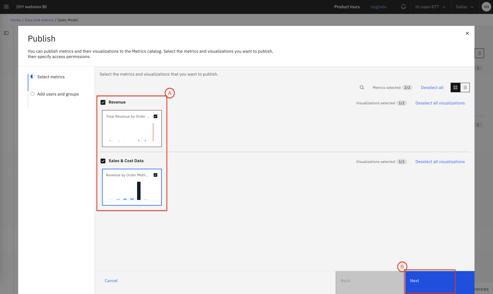 <br><br>

4. From the **Add users and groups** section, this is where you can provide access to the published metrics, if you want them for personal use for available to the business, which users can view and modify the metrics, etc. For the purposes of the lab, select the **Public** radio button (A). <br><br>
   
5. Check the checkbox for your user (B). <br><br>
   
6. Click the blue **Publish** button (C). <br><br>
    
    <!-- 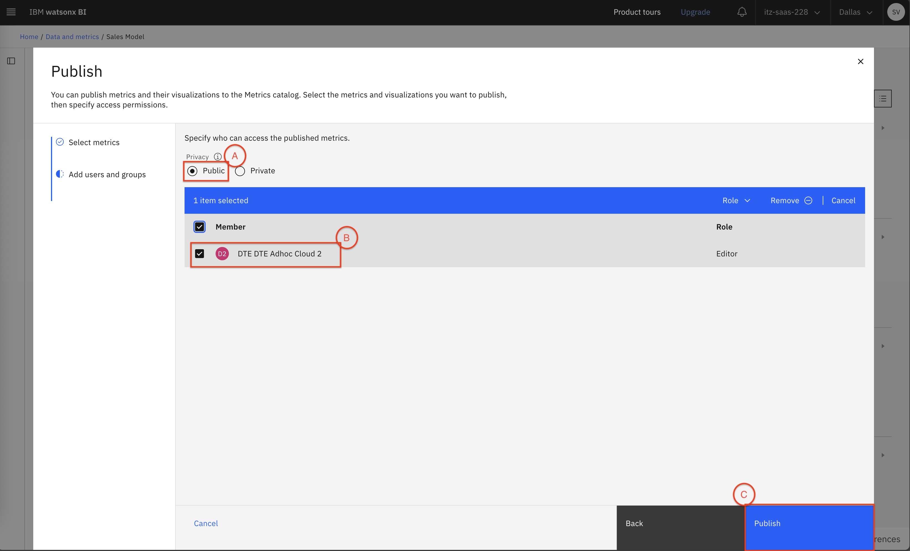 <br><br> -->
    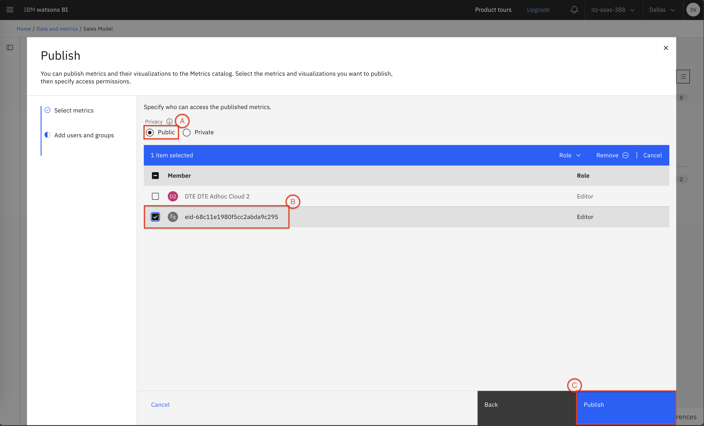 <br><br>

<!-- 7. It will fail since in this account we don't have the permission to publish but ideally, it should get published. <br><br>
    
    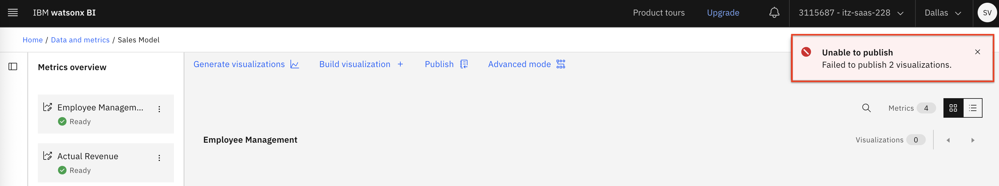 <br><br> -->

8. Now, to open the metrics catalog, click on the **IBM watsonx BI** logo in the upper-left of the interface (A). <br><br>
   
9.  Hover over the left navigation menu and select **Metrics catalog** (B). You can see your metrics and visualizations have been successfully published to the catalog. <br><br>

10. Within the metric, you can ask a question, view the data columns that are part of the metrics definition or adjust user access to the metric. Click on the **Revenue by Order Method** visualization (C). <br><br>
    
    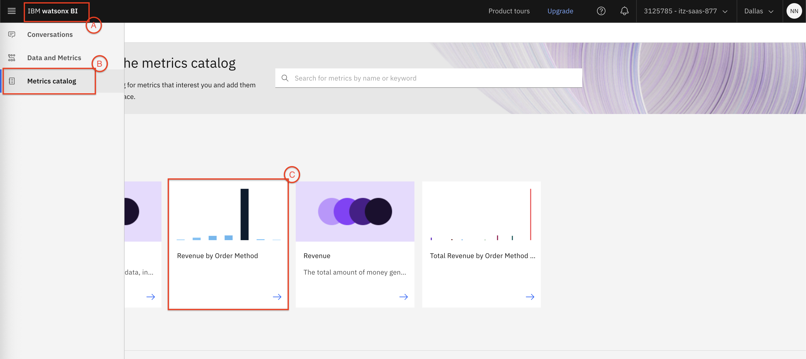 <br><br>

<!-- 11. Within the metric, you can ask a question, view the data columns that are part of the metrics definition or adjust user access to the metric. Click on the **Revenue by Order Method** visualization (A).  <br><br>
    
    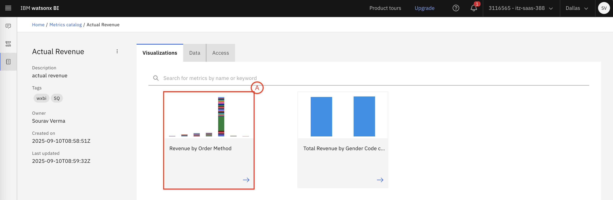 <br><br> -->

12. Click the blue **Pin to Key metrics** button (A) <br><br>
    
    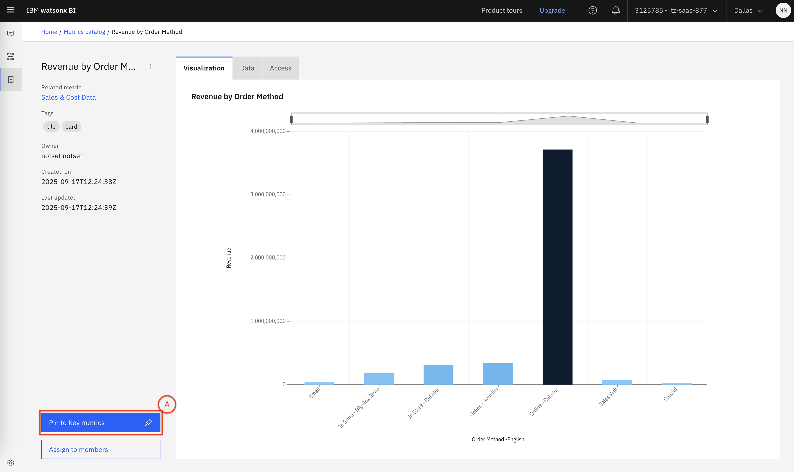 <br>

With the metrics successfully published to the catalog and pinned in the **Key metrics** (C) section, you can see and interact (D) with it after choosing **Sales Analysis** (B) from the data selection dropdown through **watsonx BI’s conversational interface** (A). <br>

 <br><br>

### 2.5 Sample Questions to Test

1. What is the total revenue across all sales?
2. How many units were sold in total by sales channel?
3. Show me revenue and gross profit broken down by order method.
4. Plot planned revenue vs. actual revenue across different order methods.
5. Which order method generated the highest gross margin percentage?
6. What is the average unit price compared to the average unit cost?
7. How much variance is there between planned revenue and actual revenue? 
   - hint: show - change data asset by selecting different data assets
8. Which order methods fell short or exceeded the most compared to planned revenue?
9.  Which order methods have high sales totals but low gross margins?
10. Which order methods have high sales quantities but low gross profit?
11. Compare quantity sold and gross profit across order methods on the same chart.
12. Show a heatmap of planned revenue vs. actual revenue gaps by order method.


### 2.6 Section summary

- In this section, you manually created metrics within your semantic model for those key performance indicators that are important to the business by reviewing the data and underlying relationships.
- You created and exported metrics definitions to the semantic model.
- You created visualizations along with the metrics to make those relevant KPIs more consumable by business users.
- You attempted to publish the metrics to a metrics catalog, in order to make them available for consumption across the organization.
- You have some sample questions to query on your data.

