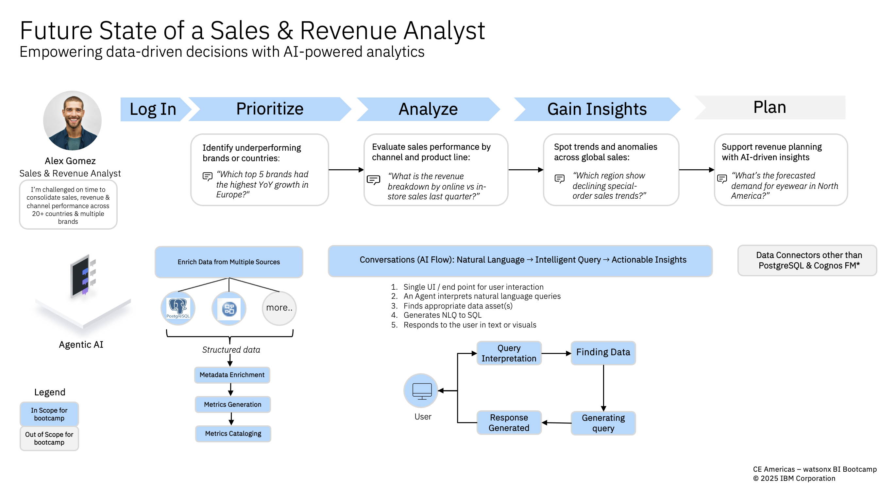

## Table of Contents
- [🥇 Conversational AI for Business Insights Usecase](#-conversational-ai-for-business-insights-usecase)
  - [🤔 The Problem: Transactional Systems without Analytics](#-the-problem-transactional-systems-without-analytics)
  - [🎯 Objectives: Unlocking the Power of AI-Driven Analytics](#-objectives-unlocking-the-power-of-ai-driven-analytics)
  - [🏛 Architecture: From Data to Decisions](#-architecture-from-data-to-decisions)
  - [📝 Step-by-Step Hands-on Labs](#-step-by-step-hands-on-labs)
    - [Prerequisites](#prerequisites)
    - [Labs](#labs)

---
# 🥇 Conversational AI for Business Insights Usecase

**TravoGears** is leading worldwide distributor of the out door and travel gears for more than 25 popular brands and does business in about 20+ countries.  TravoGears works with hunders of retails catering to customer needs for having a safe and fun outdoor experience. The market their products through various channel such as Online, in-store, email and special orders.

TravoGears aims to empower its executives, business leaders, and analysts with the ability to ask natural language questions about sales, revenue, and planning data. Instead of navigating complex reports, users can interact with an AI-powered system that delivers instant, context-aware insights, making business performance analysis more intuitive and accessible, enabling smarter prioritization, analysis, and planning.

## 🤔 The Problem: Transactional Systems without Analytics

Currently, TravoGears’ backend systems are optimized for transactions, not analytics. Analysts like Alex Gomez spend excessive time pulling data from siloed systems, leaving little room for deep analysis. Without AI-driven tools, it’s difficult to:
- Identify underperforming brands or regions in real time.
- Evaluate sales performance across different channels.
- Spot anomalies or emerging trends in global sales.
- Support revenue planning with accurate, forward-looking insights.

This results in delayed decisions and reactive rather than proactive business strategies.

## 🎯 Objectives: Unlocking the Power of AI-Driven Analytics

- Enable natural language interaction with enterprise data for faster decision-making - executives can quickly get answers without relying on IT or static reports and analysts can move from data wrangling to insight discovery, reducing turnaround time.
- Provide executives with real-time insights into sales, revenue, and profitability - ensuring leaders have the visibility needed to act on opportunities and risks.
- Enhance revenue planning and forecasting accuracy using AI-powered analytics - leading to better inventory management, optimized operations, and improved margins.
- Improve agility by offering a single platform to analyze performance across multiple channels (online, in-store, email, and special orders) - creating a unified view of the business for consistent, data-driven strategies.

If these objectives are achieved, TravoGears will shift from manual, reactive reporting to proactive, insight-led decision-making at scale.

## 🏛 Architecture: From Data to Decisions

To meet their objectives, TravoGear partnered with IBM to design a solution that integrates TravoGears’ existing transactional systems with a modern analytics layer and AI-driven natural language interface to turn their data into decisions:

1. Data Ingestion & Enrichment
   - Connect to PostgreSQL, Cognos FM, and other data sources.
   - Enrich and catalog structured sales, revenue, and planning data.
  
2. AI-Powered Analytics Engine
   - Generate key metrics and KPIs.
   - Apply anomaly detection and trend analysis.
   - Support forecasting for revenue planning.

3. Natural Language Interface
   - User logs in to a single conversational UI.
   - AI agent interprets natural language queries.
   - Queries are translated into SQL/metrics requests.
   - Responses delivered as text, tables, or visual dashboards.

4. Decision Support
   - Analysts and executives gain prioritized insights (underperforming regions, sales breakdowns, anomalies, forecasts).
   - These insights directly inform planning and business strategy.

## 📝 Step-by-Step Hands-on Labs

### Prerequisites
To run the steps in this hands-on lab portion of the bootcamp, you need access to IBM watsonx BI and IBM Cognos Analytics which are provided for you as part of the preparation for this bootcamp.
- Check with your instructor to make sure all systems are up and running before you continue.
- Complete the [Prerequisites](../Prerequisites/README.md) to setup your environment to run the (2+1) labs below.
  
### Labs
- [Lab 1: Data Consumer Experience](./Lab1-data_consumer_experience/README.md)
- [Lab 2: Data Steward/Analyst/Modeler/Config Experience](./Lab2-data_steward_experience/README.md)
- [Lab 3: Maximize Cognos Analytics Investments to deliver Conversational BI experience ](./Lab3-cognos_integration/README.md)