# Prerequisites

Before starting the bootcamp labs, you need to set up the required environments and resources. Follow the steps carefully to ensure everything is provisioned and ready.

---
- [Prerequisites](#prerequisites)
  - [Sections 1: Getting started](#sections-1-getting-started)
    - [1. Sign-up for IBMid (Optional)](#1-sign-up-for-ibmid-optional)
    - [2. Download the Classroom Repo](#2-download-the-classroom-repo)
    - [3. Access the bootcamp environment](#3-access-the-bootcamp-environment)
    - [4. Alternative way to access the bootcamp environment](#4-alternative-way-to-access-the-bootcamp-environment)
    - [5. Access the watsonx BI Service](#5-access-the-watsonx-bi-service)
  - [Sections 2: Configure IBM watsonx BI for the Labs](#sections-2-configure-ibm-watsonx-bi-for-the-labs)
    - [1. Start setup and load sample data](#1-start-setup-and-load-sample-data)
  - [Sections 3: Access the Conversational Experience](#sections-3-access-the-conversational-experience)

---
## Sections 1: Getting started

### 1. Sign-up for IBMid (Optional)
In-case you don't have an IBMid, follow this guide to create one:

1. Start by accessing the [IBMid Registration Page](https://www.ibm.com/account/reg/signup?formid=urx-19776&).   
2. Enter the required information in the fields provided, such as Email address, password, name, company, and country.   
   
   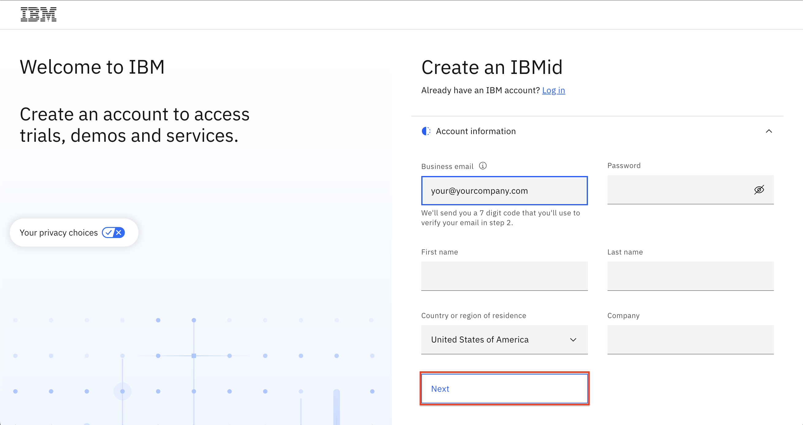   

3. Click the **Next** button. You will receive an email containing a one-time verification code.
4. In the Verification field, enter the code that is provided in the email.
5. Click Create account.
6. An email will be sent indicating that your IBMid account creation was successful and your account is now active.

**IMPORTANT**: Your email address becomes your IBMid, which you will use to access the bootcamp environment!

### 2. Download the Classroom Repo
Students will be provided with a zip file of the classroom Repo by the instructor with instructions and files needed for the Bootcamp.

### 3. Access the bootcamp environment
For completing this bootcamp you will need to access the following services.
  - **watsonx BI techzone environment**  
  
One techzone environment is needed for the labs - A shared watsonx BI environment used by all students.

To access the environments, look for email messages from **IBM Technology Zone** noreply@techzone.ibm.com inviting you to join the accounts where your environments are located.

In the email, Click on the  **`Join now`** to accept the invitation (Highlighted in the screenshot below).

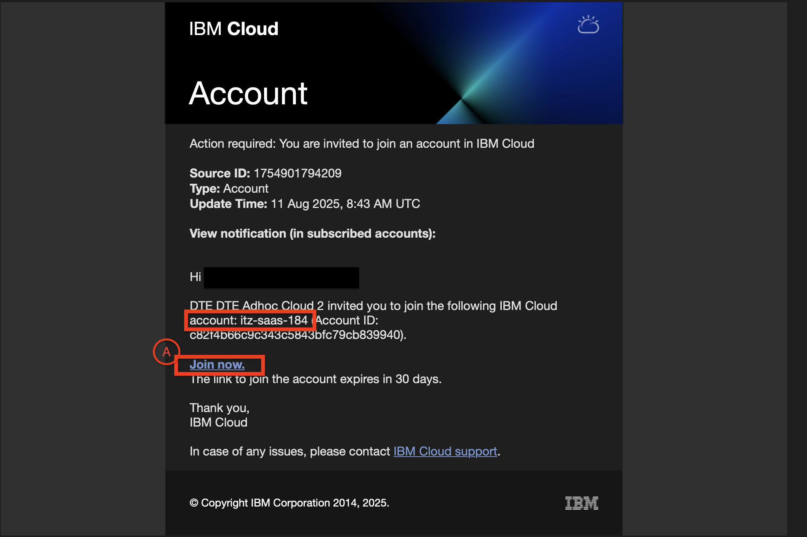

In case you miss the email - you can also find the invitation directly on your IBM Cloud account: [IBM Cloud Notifications](https://cloud.ibm.com/notifications?type=account) → click **`Join now`**.  

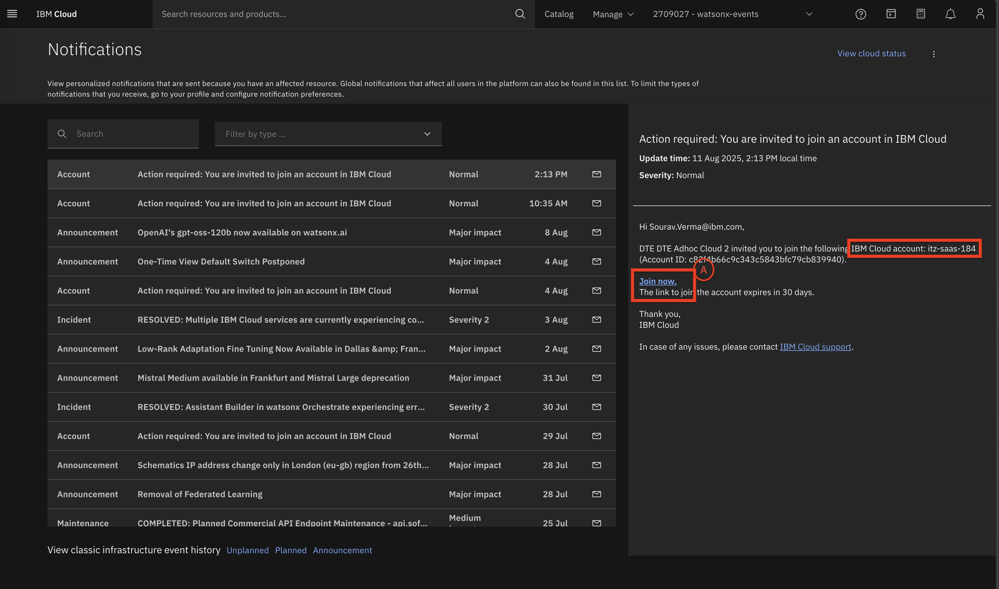

After clicking **Join now**, confirm the highlighted option to join the account.  

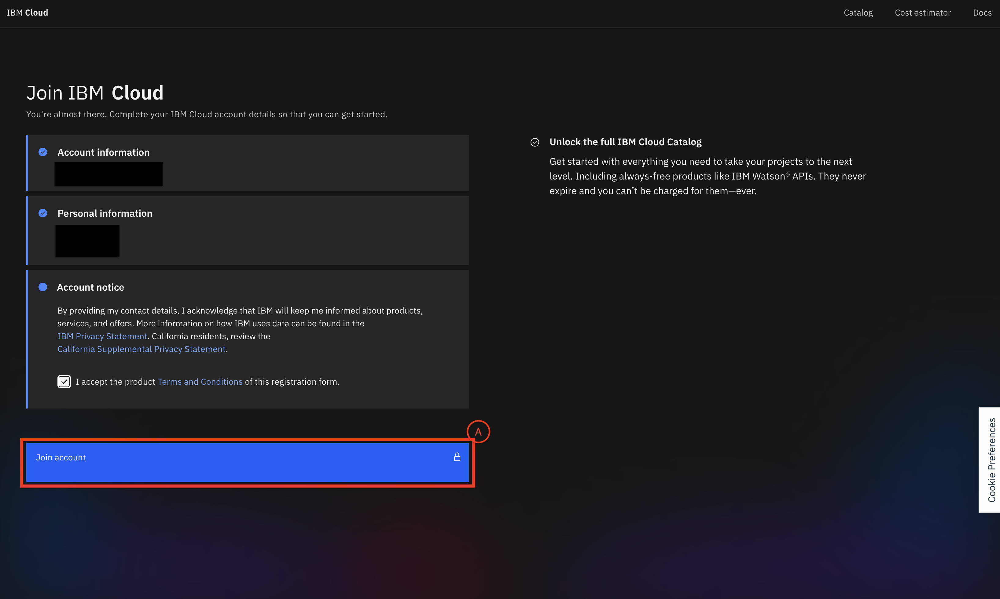

### 4. Alternative way to access the bootcamp environment

Log in to the environment using the App ID credentials provided by your instructor.

### 5. Access the watsonx BI Service

Once joined, you will be prompted to switch accounts automatically. If not: 

Use the dropdown **(Box A)** to select the correct account and you'll see the screen below - click on **Box B** to open the **Resource list** page. 

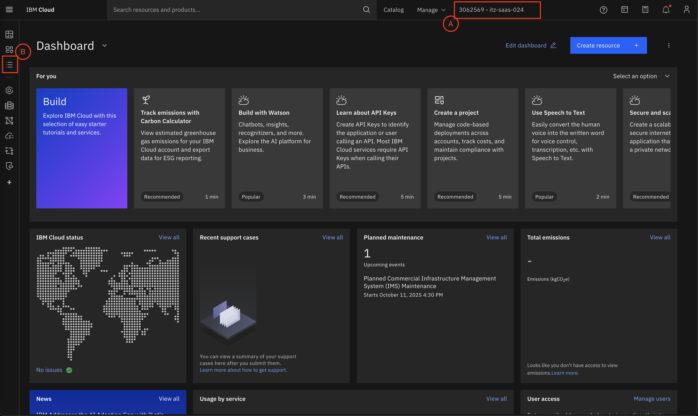

On the **Resource list** page, expand **AI/Machine Learning** and click on the watsonx BI service **Box B** to open **IBM watsonx BI** page.  

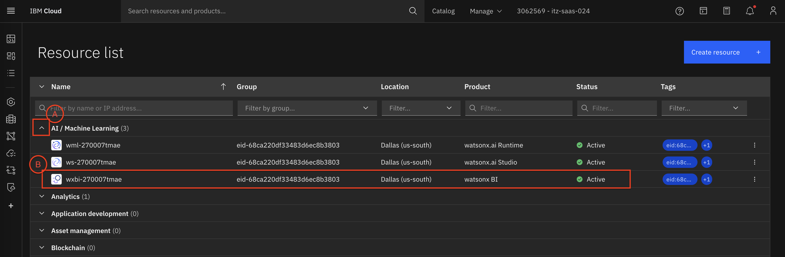

You'll come to the **IBM watsonx BI** resource page, click on the blue **Launch watsonx BI** (A) to launch it.

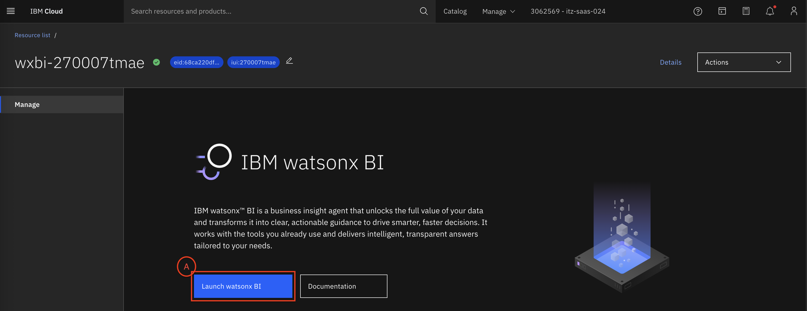

⚠️ If you see errors like below or the page does not load:  
Use this direct link to launch → [https://dataplatform.cloud.ibm.com/wxbi/](https://dataplatform.cloud.ibm.com/wxbi/)

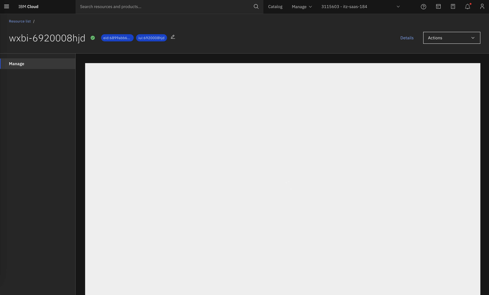

---
## Sections 2: Configure IBM watsonx BI for the Labs

### 1. Start setup and load sample data

1. Once you open the BI service → ensure you are in the correct account (check **Box A**).   

2. Click **Start setup** to start the setup.      

    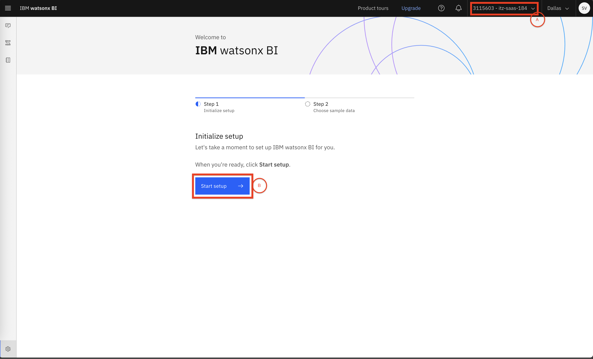    

3. Choose **Go Sales** (recommended sample dataset for this lab).   
  
    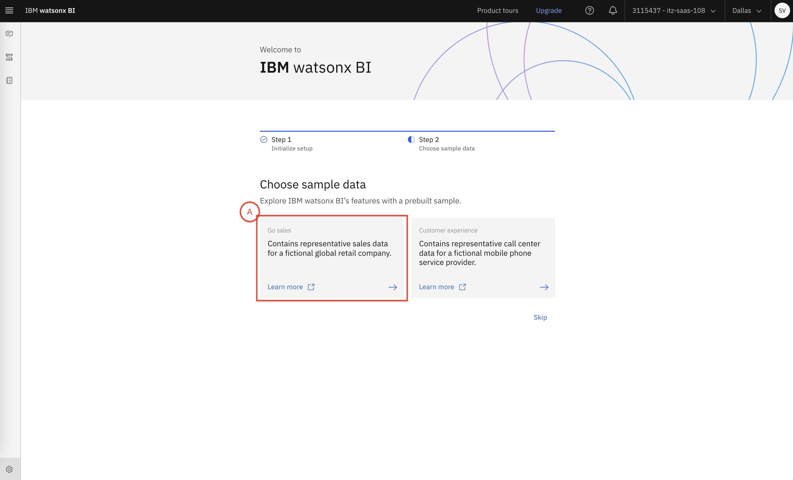   

4. The system will start loading the sample data.    

    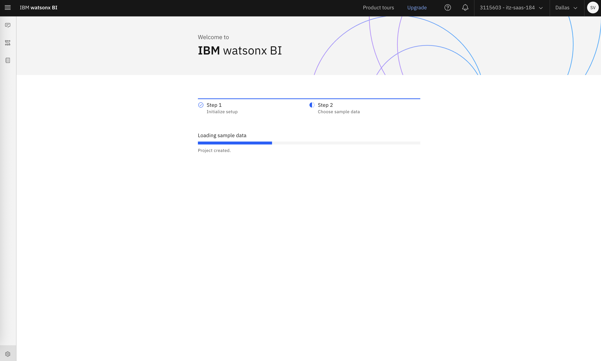   

---
## Sections 3: Access the Conversational Experience

Once the data loads, you’ll be redirected to the **watsonx BI Conversational UI**.  

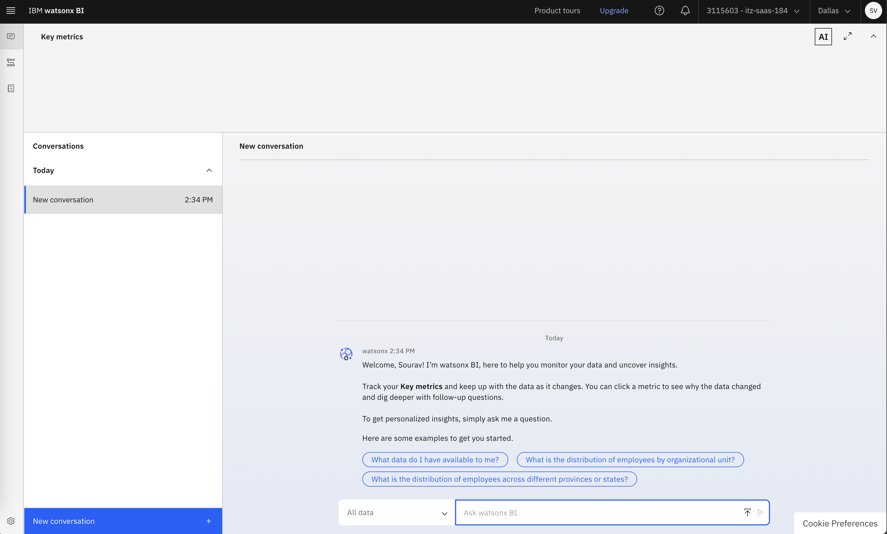  

Explore **Navigation Menu** from the hamburger menu on the top-left corner on the screen, you will see **4 options**:  
  1. **Conversations** (A)
  2. **Data and Metrics** (B)
  3. **Metrics catalog** (C)
  4. **Configuration and setting** (D)  

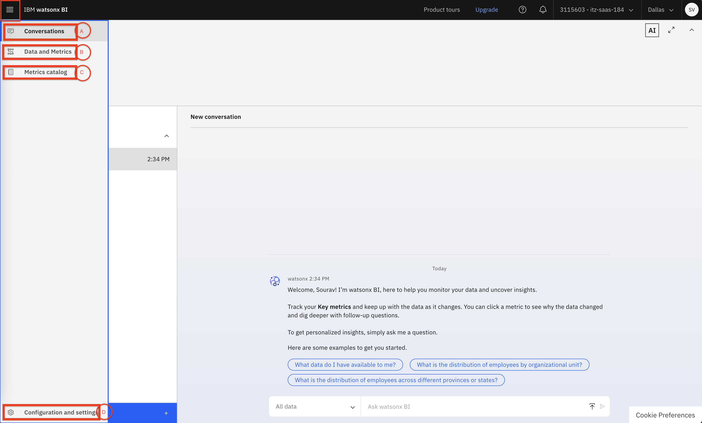   

1. **Conversations** - the default page - to be used to 
   - **Converse** with data and metrics  
   - See **published key metrics** and **conversation history**   

2. **Data and Metrics** - Here you can:  
   - `create projects` (A), 
   - `create new semantic models` (B),
   - `select data` (C) for the created semantic models, 
   - `enrich the data` (D),
   - `create metrics for the enriched data` (E), and
   - `Upload Data sources` (F)   

       

3. **Metrics Catalog** - Its the Repository of published metrics, available for conversations.     

    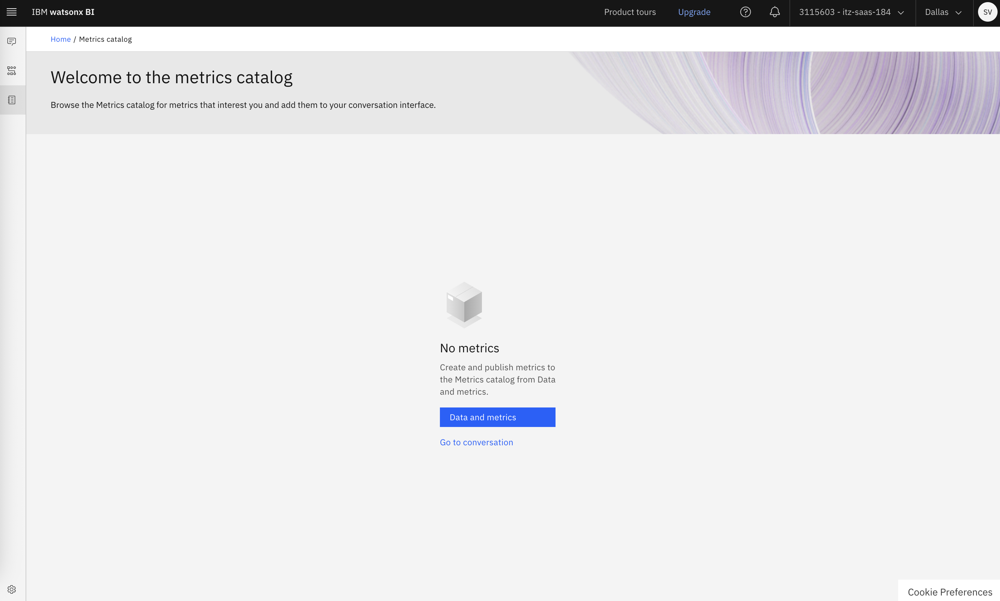   

4. **Configuration & Settings** - Here you can manage the BI configurations and settings (you might not be able to access this page because of some environment issues and that's okay.):  
   - BI community  
   - Sample data  
   - Models (LLMs)  
   - Storage  
   - Access (IAM)     

    

---
Now you're all set to perform the [Labs](../Labs/README.md).
